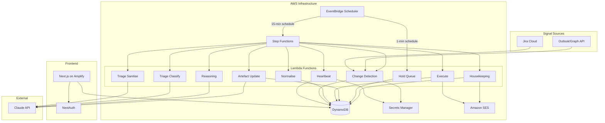
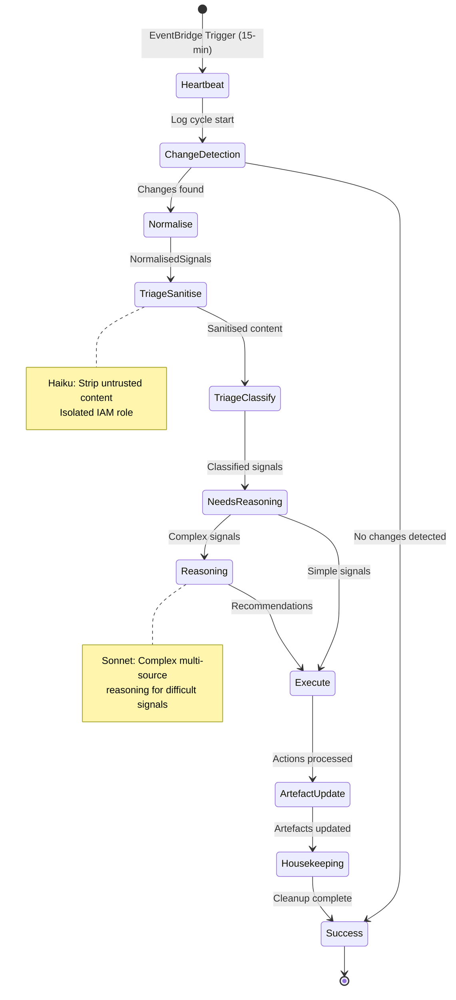
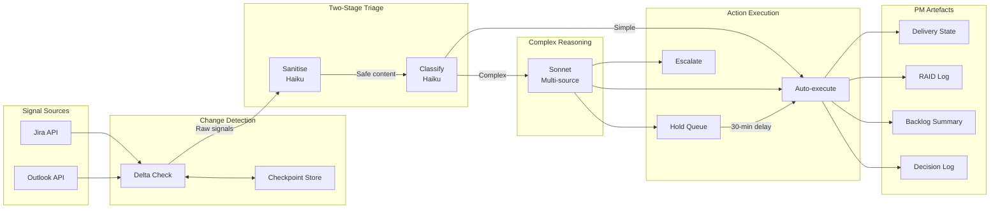
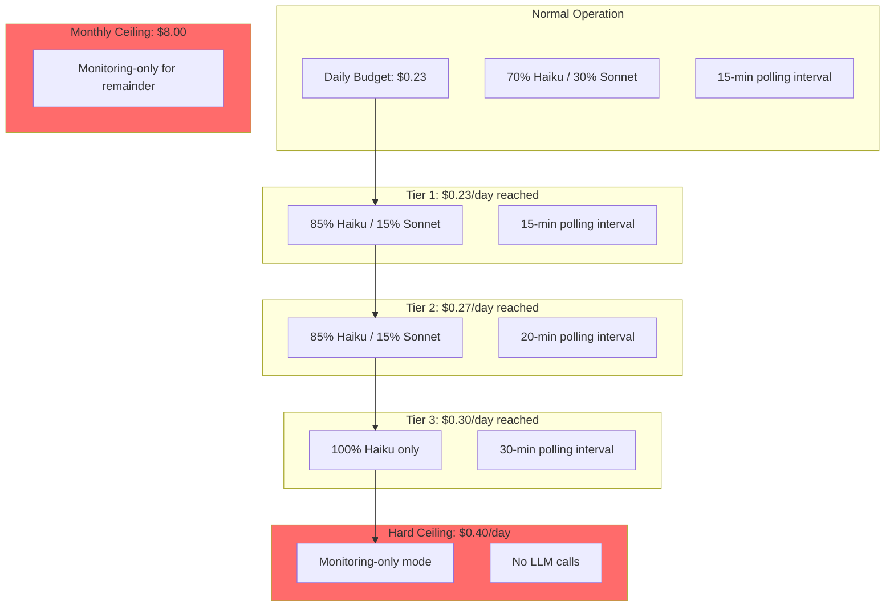

# Agentic PM Workbench

[](https://github.com/user/agentic-project-manager/actions)
[](LICENSE)
[](https://www.typescriptlang.org/)
[](https://aws.amazon.com/cdk/)
[](https://nextjs.org/)

A fully autonomous personal project management assistant that monitors Jira and Outlook, maintains PM artefacts (RAID log, delivery state, backlog summary, decision log), and handles routine PM work with minimal human intervention.

---

## Table of Contents

- [Overview](#overview)
- [Key Value Proposition](#key-value-proposition)
- [Architecture](#architecture)
  - [System Architecture](#system-architecture)
  - [Agent Workflow State Machine](#agent-workflow-state-machine)
  - [Data Flow](#data-flow)
  - [DynamoDB Single-Table Design](#dynamodb-single-table-design)
  - [Budget Degradation Ladder](#budget-degradation-ladder)
- [Features](#features)
- [Tech Stack](#tech-stack)
- [Getting Started](#getting-started)
  - [Prerequisites](#prerequisites)
  - [Installation](#installation)
  - [Local Development](#local-development)
- [Project Structure](#project-structure)
- [Configuration](#configuration)
  - [Environment Variables](#environment-variables)
  - [AWS Secrets Manager](#aws-secrets-manager)
- [Deployment](#deployment)
  - [CDK Deployment](#cdk-deployment)
  - [CI/CD Pipeline](#cicd-pipeline)
- [Development](#development)
  - [Running Tests](#running-tests)
  - [Code Style](#code-style)
  - [Contributing](#contributing)
- [Documentation](#documentation)
- [Cost Model](#cost-model)
- [License](#license)

---

## Overview

The Agentic PM Workbench is a **personal tool** (single user, no multi-tenancy) designed to automate routine project management tasks. It operates autonomously within defined boundaries, escalating decisions when needed and building trust through transparent action logging.

### What it does

- **Monitors** Jira Cloud and Outlook for project signals
- **Maintains** structured PM artefacts automatically
- **Triages** incoming signals using AI (Claude Haiku/Sonnet)
- **Executes** routine actions with human-in-the-loop safety
- **Escalates** complex decisions to the user with context

### What it is NOT

- Not a SaaS product (single user only)
- Not a replacement for Jira/Asana (synthesises data, does not duplicate)
- Not a chatbot (dashboard-first, not conversation-first)

---

## Key Value Proposition

**Cross-platform synthesis.** The agent creates structured PM artefacts that do not exist in any single tool:

- RAID logs built from Jira signals and email threads
- Delivery states assembled from sprint data and stakeholder communications
- Decision logs capturing context from multiple sources

No single-vendor AI feature (Jira Rovo, Asana AI Teammates) provides this cross-tool view.

---

## Architecture

### System Architecture



### Agent Workflow State Machine



### Data Flow



### DynamoDB Single-Table Design

```mermaid
erDiagram
    AGENTICPM {
        string PK "Partition Key"
        string SK "Sort Key"
        string GSI1PK "GSI1 Partition Key"
        string GSI1SK "GSI1 Sort Key"
    }

    PROJECT {
        string PK "PROJECT#uuid"
        string SK "METADATA"
        string name
        string status "active|paused|archived"
        string autonomyLevel "monitoring|artefact|tactical"
    }

    ARTEFACT {
        string PK "PROJECT#uuid"
        string SK "ARTEFACT#type"
        map content "Structured JSON"
        map previousVersion "One-deep undo"
        number version
    }

    EVENT {
        string PK "PROJECT#uuid"
        string SK "EVENT#timestamp#ulid"
        string eventType
        string severity
        number TTL "30-day expiry"
    }

    ESCALATION {
        string PK "PROJECT#uuid"
        string SK "ESCALATION#uuid"
        string status "pending|decided|expired"
        list options
        string userDecision
    }

    ACTION {
        string PK "PROJECT#uuid"
        string SK "ACTION#timestamp#ulid"
        string actionType
        boolean executed
        string heldUntil
        number TTL "90-day expiry"
    }

    CHECKPOINT {
        string PK "PROJECT#uuid"
        string SK "CHECKPOINT#integration#key"
        string checkpointValue
    }

    AGENTICPM ||--o{ PROJECT : contains
    AGENTICPM ||--o{ ARTEFACT : contains
    AGENTICPM ||--o{ EVENT : contains
    AGENTICPM ||--o{ ESCALATION : contains
    AGENTICPM ||--o{ ACTION : contains
    AGENTICPM ||--o{ CHECKPOINT : contains
```

### Budget Degradation Ladder



---

## Features

### Implemented

| Feature | Description |
|---------|-------------|
| **Agent Heartbeat** | 15-minute cycle logging with health checks |
| **Jira Integration** | Signal detection via Jira Cloud REST API v3 |
| **Signal Normalisation** | Convert raw API responses to structured signals |
| **Two-Stage Triage** | Sanitise (security) + Classify (routing) with Haiku |
| **Complex Reasoning** | Multi-source analysis with Sonnet for difficult signals |
| **PM Artefacts** | Delivery state, RAID log, backlog summary, decision log |
| **Hold Queue** | Draft-then-send with 30-minute approval window |
| **Escalation Workflow** | Present decisions with context and recommendations |
| **Budget Controls** | Multi-tier degradation ladder with hard ceilings |
| **Activity Feed** | Real-time event stream in dashboard |
| **Mission Control** | Dashboard with project health and agent status |

### Planned

| Feature | Phase |
|---------|-------|
| Outlook Integration (Graph API) | Phase 3 |
| Confidence Scoring | Phase 3 |
| Autonomy Graduation Ceremony | Phase 3 |
| Anti-complacency Spot Checks | Phase 3 |
| Asana Integration | Deferred |

---

## Tech Stack

### Core Technologies

| Component | Technology | Version |
|-----------|-----------|---------|
| **Language** | TypeScript (strict mode) | 5.3+ |
| **Runtime** | Node.js | 20+ |
| **Package Manager** | pnpm | 9.0+ |
| **Monorepo** | Turborepo | 2.3+ |

### Frontend

| Component | Technology | Version |
|-----------|-----------|---------|
| **Framework** | Next.js (App Router) | 14.1 |
| **Hosting** | AWS Amplify | - |
| **UI Components** | shadcn/ui + Radix UI | - |
| **Styling** | Tailwind CSS | 3.4 |
| **State** | TanStack Query | 5.17 |
| **Auth** | NextAuth.js | 4.24 |

### Backend (Serverless)

| Component | Technology | Version |
|-----------|-----------|---------|
| **Orchestration** | AWS Step Functions | - |
| **Compute** | AWS Lambda | Node.js 20 |
| **Database** | DynamoDB (on-demand) | - |
| **Scheduling** | EventBridge Scheduler | - |
| **Secrets** | AWS Secrets Manager | - |
| **Email** | Amazon SES | - |
| **Monitoring** | CloudWatch | - |
| **IaC** | AWS CDK | 2.120 |

### AI/LLM

| Component | Technology | Purpose |
|-----------|-----------|---------|
| **Triage** | Claude Haiku 4.5 | Signal sanitisation, classification (~70%) |
| **Reasoning** | Claude Sonnet 4.5 | Complex multi-source analysis (~30%) |
| **Integration** | Anthropic SDK | 0.32+ |
| **Output** | Tool-use (function calling) | Structured JSON generation |

### Integrations

| Service | API | Purpose |
|---------|-----|---------|
| **Jira Cloud** | REST API v3 | Sprint data, ticket changes |
| **Outlook** | Microsoft Graph API | Email signals (Phase 3) |
| **SES** | AWS SDK | Agent-to-user notifications |

---

## Getting Started

### Prerequisites

- **Node.js** >= 20.0.0
- **pnpm** >= 9.0.0
- **Docker** and Docker Compose (for local development)
- **AWS CLI** configured with appropriate permissions
- **AWS CDK CLI** (`npm install -g aws-cdk`)

### Installation

```bash
# Clone the repository
git clone https://github.com/user/agentic-project-manager.git
cd agentic-project-manager

# Install dependencies
pnpm install

# Build all packages
pnpm build
```

### Local Development

```bash
# Start local AWS services (DynamoDB, LocalStack, MailHog)
docker-compose up -d

# Verify services are running
docker-compose ps

# Run the Next.js frontend in development mode
pnpm dev

# Run tests
pnpm test

# Run type checking
pnpm typecheck
```

#### Local Services

| Service | URL | Purpose |
|---------|-----|---------|
| DynamoDB Local | http://localhost:8000 | Database |
| DynamoDB Admin | http://localhost:8001 | Database UI |
| LocalStack | http://localhost:4566 | SES, Secrets Manager |
| MailHog | http://localhost:8025 | Email testing UI |

---

## Project Structure

```
agentic-pm/
├── packages/
│   ├── core/                    # @agentic-pm/core - Shared business logic
│   │   ├── src/
│   │   │   ├── signals/         # Signal normalisation
│   │   │   ├── triage/          # Sanitise + classify
│   │   │   ├── reasoning/       # Sonnet reasoning
│   │   │   ├── execution/       # Action execution, boundaries, confidence
│   │   │   ├── artefacts/       # Artefact schemas and updater
│   │   │   ├── llm/             # Claude API client, tools, budget
│   │   │   ├── db/              # DynamoDB client and repositories
│   │   │   └── integrations/    # Jira, Outlook, SES clients
│   │   └── package.json
│   │
│   ├── lambdas/                 # @agentic-pm/lambdas - Lambda handlers
│   │   ├── src/
│   │   │   ├── heartbeat/       # Cycle start, health check
│   │   │   ├── change-detection/# Poll Jira/Outlook for deltas
│   │   │   ├── normalise/       # Transform raw signals
│   │   │   ├── triage-sanitise/ # Strip untrusted content
│   │   │   ├── triage-classify/ # Classify and route signals
│   │   │   ├── reasoning/       # Complex multi-source reasoning
│   │   │   ├── execute/         # Execute approved actions
│   │   │   ├── artefact-update/ # Update PM artefacts
│   │   │   ├── housekeeping/    # Daily cleanup, digest
│   │   │   └── hold-queue/      # Process held actions
│   │   └── package.json
│   │
│   ├── web/                     # @agentic-pm/web - Next.js frontend
│   │   ├── src/
│   │   │   ├── app/
│   │   │   │   ├── (dashboard)/ # Mission Control, Activity, Projects
│   │   │   │   ├── api/         # API routes for user actions
│   │   │   │   └── auth/        # NextAuth routes
│   │   │   ├── components/      # UI components
│   │   │   └── lib/             # Hooks, utilities
│   │   └── package.json
│   │
│   └── cdk/                     # @agentic-pm/cdk - Infrastructure
│       ├── lib/
│       │   ├── database-stack.ts
│       │   ├── compute-stack.ts
│       │   ├── frontend-stack.ts
│       │   └── monitoring-stack.ts
│       └── package.json
│
├── solution-design/             # Technical design documents
├── docker-compose.yml           # Local development services
├── pnpm-workspace.yaml          # Monorepo workspace config
├── turbo.json                   # Turborepo pipeline config
├── SPEC.md                      # Source of truth specification
├── DEVELOPMENT.md               # Engineering guide
└── CLAUDE.md                    # Project instructions
```

---

## Configuration

### Environment Variables

#### Frontend (`packages/web`)

| Variable | Description | Required |
|----------|-------------|----------|
| `NEXTAUTH_URL` | Base URL for NextAuth | Yes |
| `NEXTAUTH_SECRET` | Secret for session encryption | Yes |
| `AWS_REGION` | AWS region | Yes |
| `DYNAMODB_TABLE_NAME` | DynamoDB table name | Yes |

#### Lambda Functions

| Variable | Description | Required |
|----------|-------------|----------|
| `DYNAMODB_TABLE_NAME` | DynamoDB table name | Yes |
| `SECRETS_PREFIX` | Secrets Manager path prefix | Yes |
| `LOG_LEVEL` | Logging level (debug/info/warn/error) | No |

### AWS Secrets Manager

All sensitive credentials are stored in AWS Secrets Manager:

| Secret Path | Description |
|-------------|-------------|
| `/agentic-pm/llm/api-key` | Claude API key |
| `/agentic-pm/jira/api-token` | Jira API token |
| `/agentic-pm/jira/base-url` | Jira instance URL |
| `/agentic-pm/jira/email` | Jira account email |
| `/agentic-pm/graph/client-id` | Azure AD client ID |
| `/agentic-pm/graph/client-secret` | Azure AD client secret |
| `/agentic-pm/graph/tenant-id` | Azure AD tenant ID |
| `/agentic-pm/auth/nextauth-secret` | NextAuth session secret |
| `/agentic-pm/auth/user-credentials` | User login credentials (bcrypt) |

---

## Deployment

### CDK Deployment

```bash
# Navigate to CDK package
cd packages/cdk

# Bootstrap CDK (first time only)
pnpm cdk bootstrap

# Synthesise CloudFormation templates
pnpm cdk synth

# Deploy to development environment
pnpm cdk deploy --context env=dev

# Deploy to production
pnpm cdk deploy --context env=prod

# View differences before deploying
pnpm cdk diff
```

### CDK Stacks

| Stack | Resources |
|-------|-----------|
| `AgenticPmDatabaseStack` | DynamoDB table, GSI, TTL configuration |
| `AgenticPmComputeStack` | Lambda functions, Step Functions, EventBridge |
| `AgenticPmFrontendStack` | Amplify app, custom domain (optional) |
| `AgenticPmMonitoringStack` | CloudWatch alarms, dashboards, log groups |

### CI/CD Pipeline

The project uses GitHub Actions for continuous integration and deployment:

```yaml
# .github/workflows/ci.yml
- Build and test all packages
- Type checking
- Lint checking
- Deploy to dev on push to main
- Deploy to prod on release tag
```

---

## Development

### Running Tests

```bash
# Run all tests
pnpm test

# Run tests in watch mode
pnpm test:watch

# Run tests for specific package
pnpm --filter @agentic-pm/core test

# Run type checking
pnpm typecheck

# Run linting
pnpm lint
```

### Code Style

- **TypeScript strict mode** - No `any` types
- **Zod** for runtime validation
- **Explicit return types** on functions
- **British English** in comments and strings
- **Prettier** for formatting
- **ESLint** for linting

```bash
# Format code
pnpm format

# Check formatting
pnpm format:check
```

### Testing Pyramid

| Layer | Tool | Coverage Target |
|-------|------|-----------------|
| Unit | Vitest | 80% of core logic |
| Integration | Vitest + DynamoDB Local | All DB operations |
| E2E | Playwright | Critical user flows |
| LLM Quality | Golden scenarios | 10+ scenarios, >= 90% accuracy |

### Contributing

1. Create a feature branch from `main`
2. Make changes following code style guidelines
3. Write tests for new functionality
4. Run `pnpm test` and `pnpm typecheck`
5. Create a pull request with clear description

---

## Documentation

| Document | Purpose |
|----------|---------|
| [`SPEC.md`](SPEC.md) | **Source of truth** - Implementation-ready specification |
| [`DEVELOPMENT.md`](DEVELOPMENT.md) | Engineering guide with sprint breakdown |
| [`CLAUDE.md`](CLAUDE.md) | Project instructions for Claude Code |
| [`solution-design/`](solution-design/) | Technical design documents (9 files) |

### Solution Design Documents

| Document | Content |
|----------|---------|
| `00-gap-analysis.md` | 47 gaps identified, 4 critical blockers |
| `01-technical-architecture.md` | Diagrams, ASL, Lambda specs |
| `02-api-schemas.md` | TypeScript types, Zod schemas |
| `03-dev-backlog.md` | Epics, user stories, sprints |
| `04-competitor-analysis.md` | Market gap analysis |
| `05-scalability-analysis.md` | Growth scenarios |
| `06-prompt-library.md` | System prompts, tool schemas |
| `07-testing-strategy.md` | Test pyramid, golden scenarios |
| `08-infrastructure-code.md` | CDK, CI/CD, docker-compose |

---

## Cost Model

### Monthly Budget: $15 (ceiling)

| Service | Monthly Cost | Notes |
|---------|--------------|-------|
| AWS Amplify Hosting | ~$0.50 | Build minutes + hosting |
| AWS Lambda | ~$0.00 | Free tier (1M requests) |
| AWS Step Functions | ~$1.00 | ~2,900 executions/month |
| DynamoDB (on-demand) | ~$0.25 | Minimal storage and I/O |
| Secrets Manager | ~$2.00 | 4 secrets + API calls |
| Amazon SES | ~$0.00 | Free tier (62,000 emails) |
| CloudWatch | ~$1-2.00 | Logs, metrics, alarms |
| **AWS Subtotal** | **~$5-8** | |
| Claude API (Haiku/Sonnet) | ~$5-7.00 | With prompt caching |
| **Total** | **~$11-13** | Well under $15 ceiling |

### Critical Cost Traps to Avoid

| Trap | Monthly Cost | Prevention |
|------|--------------|------------|
| NAT Gateway | ~$33 | Lambda runs OUTSIDE VPC |
| Aurora Serverless | ~$44+ | Use DynamoDB instead |
| RDS | ~$15+ | Use DynamoDB instead |

---

## License

This project is licensed under the MIT License - see the [LICENSE](LICENSE) file for details.

---

<p align="center">
  <strong>Agentic PM Workbench</strong><br/>
  Autonomous project management, simplified.
</p>
