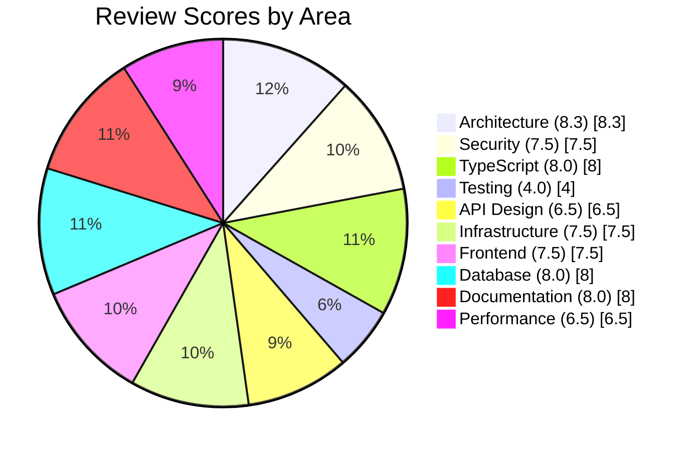

# Consolidated Critique Summary Report

**Project:** Agentic PM Workbench **Branch:**
`claude/setup-monorepo-structure-V2G3w` **Date:** 2026-02-05 **Reviews
Consolidated:** 10

---

## 1. Executive Summary

The Agentic PM Workbench demonstrates a **well-architected foundation** for a
personal project management assistant. The codebase exhibits mature patterns
including a clean monorepo structure, excellent IAM isolation for LLM security,
and comprehensive type definitions. The architecture is appropriate for its
stated purpose as a single-user tool with a $15/month budget ceiling.

The most significant strength across all reviews is the **security
architecture**, particularly the two-stage triage pipeline with IAM-enforced
isolation between triage and execution Lambdas. This defence-in-depth approach
represents industry best practice for autonomous LLM systems. The DynamoDB
single-table design, TypeScript strict mode configuration, and TanStack Query
implementation are also notable strengths.

However, several critical gaps must be addressed before production deployment.
**Testing coverage is severely deficient** (4/10), with security-critical
modules like `sanitise.ts` and `boundaries.ts` having zero test coverage. The
API layer lacks Zod validation on mutation endpoints (a stated project
requirement), and the authentication system has timing vulnerabilities. Lambda
bundles are not minified, impacting cold start performance. Addressing these
gaps should be the immediate priority for Phase 1 development.

---

## 2. Scorecard

| Review Area    |      Score | Critical Issues | Warnings |
| -------------- | ---------: | --------------: | -------: |
| Architecture   |     8.3/10 |               0 |        5 |
| Security       |     7.5/10 |               0 |        5 |
| TypeScript     |     8.0/10 |               1 |        5 |
| Testing        |     4.0/10 |               5 |        6 |
| API Design     |     6.5/10 |               2 |        5 |
| Infrastructure |     7.5/10 |               0 |        4 |
| Frontend       |     7.5/10 |               0 |        4 |
| Database       |     8.0/10 |               0 |        2 |
| Documentation  |     8.0/10 |               3 |        4 |
| Performance    |     6.5/10 |               0 |        4 |
| **Overall**    | **7.2/10** |          **11** |   **44** |

---

## 3. Critical Issues

All issues requiring immediate attention before production deployment:

### Security-Critical Testing Gaps

| Module                    | Risk Level | Issue                                         |
| ------------------------- | ---------- | --------------------------------------------- |
| `triage/sanitise.ts`      | CRITICAL   | 86 injection patterns with zero test coverage |
| `execution/boundaries.ts` | CRITICAL   | Decision boundaries untested                  |
| `execution/confidence.ts` | CRITICAL   | Confidence scoring logic untested             |
| `llm/budget.ts`           | CRITICAL   | Budget tracking logic untested                |
| `llm/client.ts`           | CRITICAL   | Claude API client with no unit tests          |

### API Validation Gaps

| Issue                          | Location                                | Risk                                  |
| ------------------------------ | --------------------------------------- | ------------------------------------- |
| No Zod validation on mutations | All POST/PATCH API routes               | Runtime errors, data integrity issues |
| HEAD method missing auth       | `/api/escalations`, `/api/held-actions` | Information disclosure                |

### TypeScript Type Safety

| Issue                 | Location                             | Risk                                     |
| --------------------- | ------------------------------------ | ---------------------------------------- |
| No Zod type inference | `types/index.ts`, `schemas/index.ts` | Type/schema drift causing runtime errors |

### Documentation Gaps

| Missing File      | Impact                                 |
| ----------------- | -------------------------------------- |
| `LICENSE`         | Legal uncertainty for any code sharing |
| `CONTRIBUTING.md` | No contributor guidance                |
| `CHANGELOG.md`    | No version history tracking            |

---

## 4. High Priority Recommendations

Top 10 recommendations across all reviews, ordered by impact and urgency:

### 1. Add Unit Tests for Security-Critical Modules

**Source:** Testing Review (P0) **Effort:** High | **Impact:** Critical

The `sanitise.ts`, `boundaries.ts`, and `confidence.ts` modules are
defence-in-depth layers against prompt injection. These require 100% test
coverage before production.

### 2. Implement Zod Validation on All API Mutation Endpoints

**Source:** API Review **Effort:** Medium | **Impact:** High

Create shared schemas in `/packages/web/src/schemas/` and validate all
POST/PATCH request bodies. This is a stated project requirement in CLAUDE.md.

### 3. Fix Password Timing Attack Vulnerability

**Source:** Security Review (M1) **Effort:** Low | **Impact:** High

Replace string comparison with `crypto.timingSafeEqual()` in `auth-options.ts`.

### 4. Update Vulnerable Dependencies

**Source:** Security Review (M2) **Effort:** Low | **Impact:** High

Upgrade `next` to `>=15.5.10` to address high-severity CVEs
(GHSA-h25m-26qc-wcjf, GHSA-9g9p-9gw9-jx7f).

### 5. Add Next.js Middleware for Route Protection

**Source:** Security Review (M3) **Effort:** Low | **Impact:** High

Create `/packages/web/src/middleware.ts` to globally protect routes, preventing
authentication bypass on new endpoints.

### 6. Enable Lambda Bundle Minification

**Source:** Performance Review **Effort:** Low | **Impact:** High (40-60% bundle
size reduction)

Set `minify: process.env.NODE_ENV === 'production'` in
`/packages/lambdas/scripts/bundle.js`.

### 7. Consolidate DECISION_BOUNDARIES Definition

**Source:** Architecture Review **Effort:** Low | **Impact:** Medium

Remove duplicate definition in `constants.ts` and import from
`execution/boundaries.ts` to prevent drift.

### 8. Add SNS Topics for CloudWatch Alarm Notifications

**Source:** Infrastructure Review **Effort:** Low | **Impact:** Medium

Alarms are created but have no notification targets. Failures will go unnoticed
without alert configuration.

### 9. Convert Budget Tracking to Atomic Increment

**Source:** Database Review **Effort:** Low | **Impact:** Medium

Use DynamoDB `UpdateExpression: 'SET #value = #value + :amount'` instead of
read-modify-write pattern to prevent race conditions.

### 10. Derive TypeScript Types from Zod Schemas

**Source:** TypeScript Review **Effort:** Medium | **Impact:** Medium

Use `z.infer<typeof Schema>` to eliminate type/schema duplication and prevent
drift.

---

## 5. Quick Wins

Easy fixes that provide immediate value (low effort, measurable impact):

| #   | Fix                                   | File(s)                                                 | Time   |
| --- | ------------------------------------- | ------------------------------------------------------- | ------ |
| 1   | Enable Lambda minification            | `lambdas/scripts/bundle.js`                             | 5 min  |
| 2   | Add auth check to HEAD methods        | `api/escalations/route.ts`, `api/held-actions/route.ts` | 15 min |
| 3   | Add LICENSE file                      | Root directory                                          | 5 min  |
| 4   | Add ARIA labels to navigation         | `(dashboard)/layout.tsx`                                | 15 min |
| 5   | Fix password timing comparison        | `auth-options.ts`                                       | 10 min |
| 6   | Add skip-to-content link              | `(dashboard)/layout.tsx`                                | 10 min |
| 7   | Remove Docker socket mount            | `docker-compose.yml`                                    | 2 min  |
| 8   | Add stack tags for cost tracking      | CDK stacks                                              | 10 min |
| 9   | Consolidate time formatting utilities | Create `lib/utils/time.ts`                              | 30 min |
| 10  | Add `@next/bundle-analyzer`           | `packages/web/package.json`                             | 10 min |

---

## 6. Technical Debt Backlog

Issues to address in future sprints (not blocking production but should be
tracked):

### Architecture Debt

- [ ] Incomplete dependency injection pattern - modules read `process.env`
      directly
- [ ] Lambda handlers using mock data instead of DynamoDB
- [ ] Shared AWS SDK versions across packages (potential drift)
- [ ] Logger singleton in Lambda context (warm container issues)
- [ ] Constants file mixing configuration with boundary logic

### TypeScript Debt

- [ ] CDK package has relaxed compiler settings
- [ ] Type duplication between core and web packages (408 lines)
- [ ] 80+ type assertions (`as`) that could be replaced with type guards
- [ ] Missing discriminator on `ArtefactContent` union type
- [ ] JSON.parse without Zod validation in several locations

### Frontend Debt

- [ ] No error boundaries implemented
- [ ] Missing component memoisation (ProjectCards, ActivityFeed, ArtefactViewer)
- [ ] No dynamic imports for heavy components
- [ ] Multiple countdown intervals instead of shared manager
- [ ] No mobile navigation (hamburger menu)

### Infrastructure Debt

- [ ] SES permissions overly permissive (`resources: ['*']`)
- [ ] No secrets rotation configured
- [ ] CloudWatch log groups not encrypted with KMS
- [ ] No dead letter queues for Lambda failures
- [ ] Missing Lambda reserved concurrency limits

### Database Debt

- [ ] Client-side filtering instead of `FilterExpression`
- [ ] Missing optimistic locking on updates
- [ ] No projection expressions on queries (retrieving unnecessary attributes)

### Documentation Debt

- [ ] README uses placeholder `<repo>` for git clone URL
- [ ] Some references to `solution-design/` instead of `docs/design/`
- [ ] No troubleshooting or FAQ documentation
- [ ] JSDoc coverage inconsistent across Lambda handlers

---

## 7. Risk Assessment

### Overall Project Risk: MEDIUM

The project has a solid architectural foundation but significant gaps in testing
and validation create risk for production deployment.

| Risk Category       | Level  | Mitigation                                                                                        |
| ------------------- | ------ | ------------------------------------------------------------------------------------------------- |
| **Security**        | Medium | Strong IAM isolation mitigates LLM risks; authentication timing and missing middleware need fixes |
| **Reliability**     | High   | 5 security-critical modules untested; no integration or E2E tests                                 |
| **Budget**          | Low    | Cost projections well within $15/month ceiling; LLM prompt caching ready                          |
| **Maintainability** | Low    | Clean architecture, good documentation, TypeScript strict mode                                    |
| **Performance**     | Medium | Lambda cold starts suboptimal; no frontend code splitting                                         |

### Risk Matrix

```
              Low Impact    Medium Impact    High Impact
            +--------------+--------------+--------------+
High Prob   |              | Lambda perf  | Testing gaps |
            |              |              |              |
Medium Prob |              | Type drift   | Auth vulns   |
            |              |              |              |
Low Prob    | Doc gaps     | DB race cond | Dependency   |
            |              |              | CVEs         |
            +--------------+--------------+--------------+
```

---

## 8. Review Scores Visualisation



### Score Distribution

```
Architecture   ████████░░ 8.3/10
Security       ████████░░ 7.5/10
TypeScript     ████████░░ 8.0/10
Testing        ████░░░░░░ 4.0/10  ← Needs immediate attention
API Design     ███████░░░ 6.5/10
Infrastructure ████████░░ 7.5/10
Frontend       ████████░░ 7.5/10
Database       ████████░░ 8.0/10
Documentation  ████████░░ 8.0/10
Performance    ███████░░░ 6.5/10
─────────────────────────────────
OVERALL        ███████░░░ 7.2/10
```

---

## 9. Next Steps

### Immediate Actions (Before Sprint 1)

1. **Fix security vulnerabilities**
   - [ ] Password timing attack (M1)
   - [ ] Add Next.js middleware (M3)
   - [ ] Update vulnerable dependencies (M2)

2. **Add critical tests**
   - [ ] `triage/sanitise.ts` - all 86 injection patterns
   - [ ] `execution/boundaries.ts` - all boundary categories
   - [ ] `llm/budget.ts` - degradation ladder

3. **Add missing files**
   - [ ] LICENSE (MIT)
   - [ ] CHANGELOG.md

### Sprint 1 Priorities

4. **Complete API validation**
   - [ ] Create Zod schemas for all mutation endpoints
   - [ ] Add authentication to HEAD methods

5. **Performance quick wins**
   - [ ] Enable Lambda minification
   - [ ] Add bundle analyser

6. **Infrastructure fixes**
   - [ ] Add SNS topics for alarm notifications
   - [ ] Restrict SES permissions
   - [ ] Remove Docker socket mount

### Sprint 2 Priorities

7. **Expand test coverage**
   - [ ] Remaining Lambda handlers (10 of 11 untested)
   - [ ] Repository layer tests
   - [ ] Set up DynamoDB Local for integration tests

8. **Frontend improvements**
   - [ ] Implement error boundaries
   - [ ] Add dynamic imports for heavy components
   - [ ] Complete keyboard navigation

9. **TypeScript improvements**
   - [ ] Derive types from Zod schemas
   - [ ] Align CDK tsconfig with base

### Phase 2 and Beyond

10. **Complete testing infrastructure**
    - [ ] LLM evaluation framework
    - [ ] E2E tests with Playwright
    - [ ] CI/CD quality gates

11. **Advanced features**
    - [ ] API versioning strategy
    - [ ] OpenAPI specification generation
    - [ ] Performance monitoring dashboards

---

## Appendix: Review Source Files

| Review         | File                                    | Reviewer                    |
| -------------- | --------------------------------------- | --------------------------- |
| Architecture   | `docs/reviews/architecture-review.md`   | Senior Software Architect   |
| Security       | `docs/reviews/security-review.md`       | Security Engineer           |
| TypeScript     | `docs/reviews/typescript-review.md`     | Claude (Opus 4.5)           |
| Testing        | `docs/reviews/testing-review.md`        | QA Engineer                 |
| API Design     | `docs/reviews/api-review.md`            | API Design Expert           |
| Infrastructure | `docs/reviews/infrastructure-review.md` | Cloud Infrastructure Expert |
| Frontend       | `docs/reviews/frontend-review.md`       | Frontend Expert             |
| Database       | `docs/reviews/database-review.md`       | DynamoDB Expert             |
| Documentation  | `docs/reviews/documentation-review.md`  | Technical Writer            |
| Performance    | `docs/reviews/performance-review.md`    | Performance Engineering     |

---

_Report generated: 2026-02-05_ _Total reviews consolidated: 10_ _Total issues
identified: 55 (11 critical, 44 warnings)_
