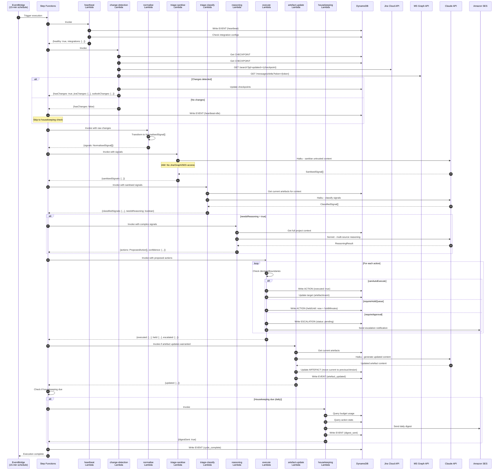
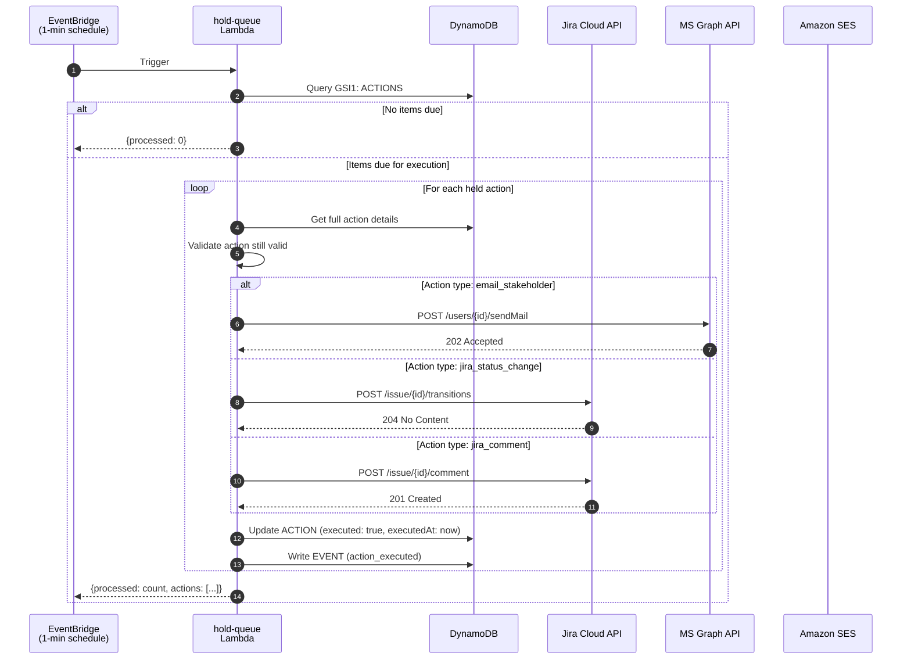
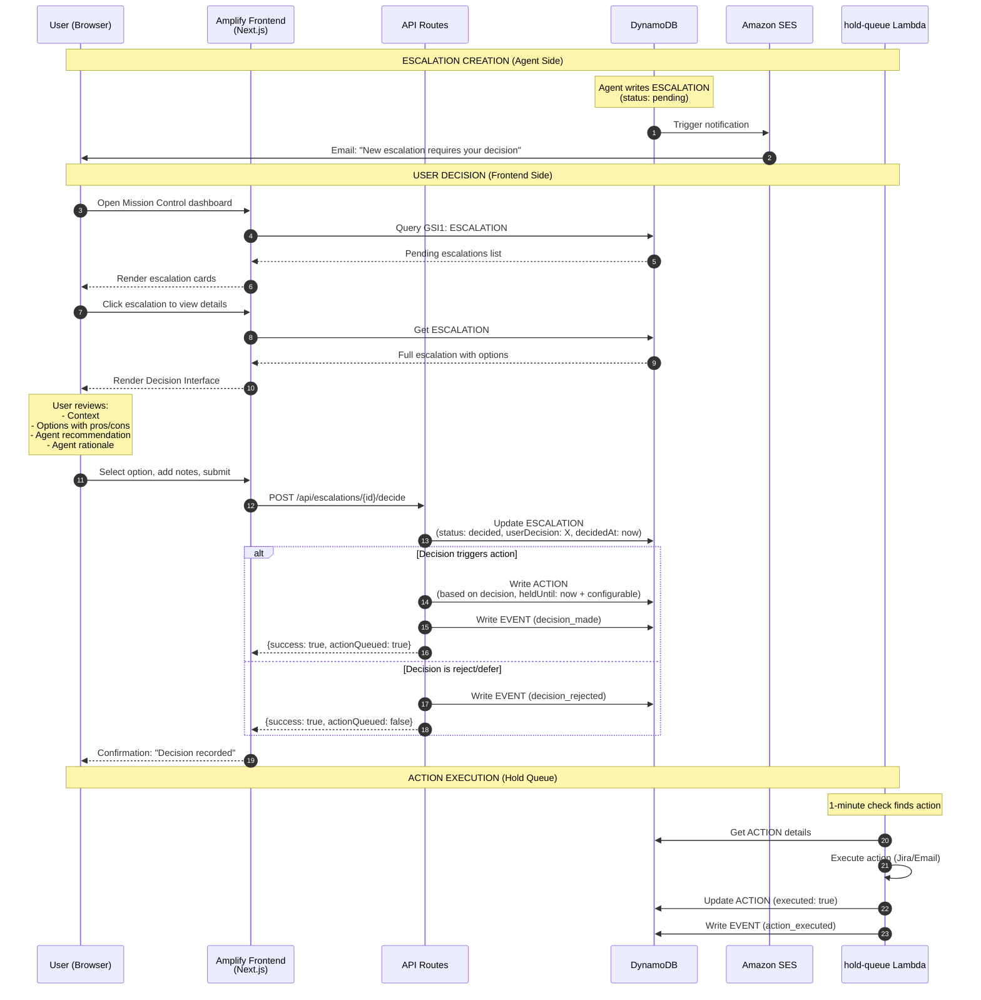
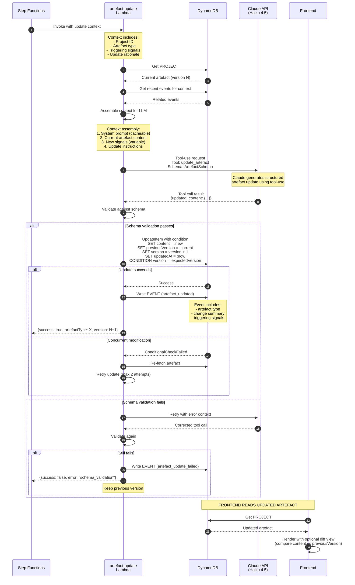
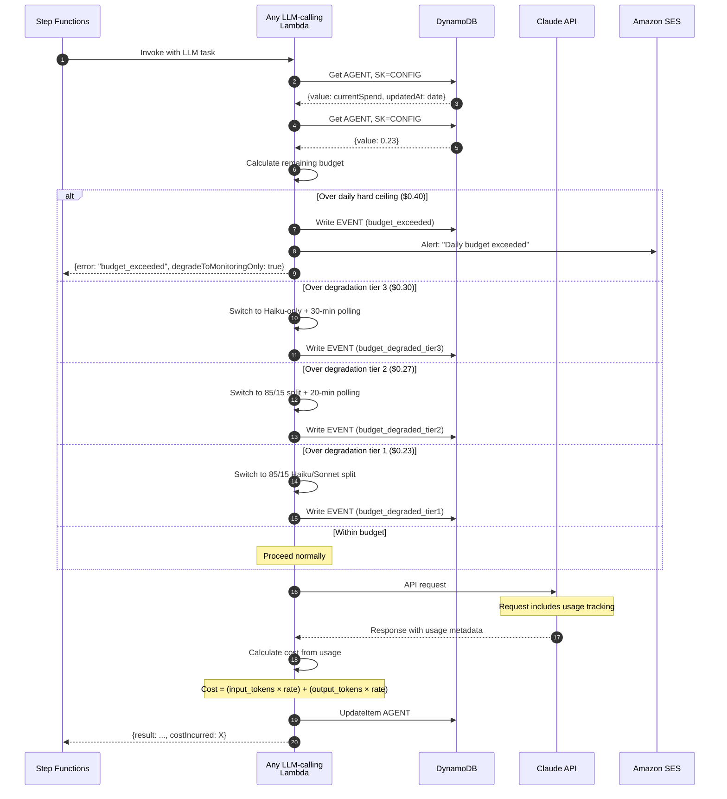

# Agentic PM Workbench — Technical Architecture

> **Version:** 1.0
> **Last Updated:** February 2026
> **Status:** Implementation-ready
> **Source:** Derived from `SPEC.md`

---

## Table of Contents

1. [Component Diagram](#1-component-diagram)
2. [Sequence Diagrams](#2-sequence-diagrams)
3. [Lambda Function Specifications](#3-lambda-function-specifications)
4. [Step Functions ASL](#4-step-functions-asl)
5. [IAM Policy Definitions](#5-iam-policy-definitions)
6. [Infrastructure Dependencies](#6-infrastructure-dependencies)

---

## 1. Component Diagram

### 1.1 High-Level Architecture

```
┌─────────────────────────────────────────────────────────────────────────────────────────┐
│                                    AWS CLOUD                                             │
│                                                                                          │
│  ┌──────────────────────────────────────────────────────────────────────────────────┐   │
│  │                              USER LAYER                                           │   │
│  │                                                                                   │   │
│  │   ┌─────────────────────────────────────────────────────────────────────────┐    │   │
│  │   │                    AWS AMPLIFY HOSTING                                   │    │   │
│  │   │                    (~$0.50/month)                                        │    │   │
│  │   │  ┌────────────────────────────────────────────────────────────────┐     │    │   │
│  │   │  │                   NEXT.JS APP ROUTER                            │     │    │   │
│  │   │  │                                                                 │     │    │   │
│  │   │  │  ┌──────────────┐  ┌──────────────┐  ┌──────────────┐          │     │    │   │
│  │   │  │  │   Mission    │  │   Activity   │  │   Decision   │          │     │    │   │
│  │   │  │  │   Control    │  │     Feed     │  │  Interface   │          │     │    │   │
│  │   │  │  │  (SSR+RSC)   │  │  (SSR+RSC)   │  │  (SSR+RSC)   │          │     │    │   │
│  │   │  │  └──────────────┘  └──────────────┘  └──────────────┘          │     │    │   │
│  │   │  │                                                                 │     │    │   │
│  │   │  │  ┌──────────────┐  ┌──────────────┐  ┌──────────────┐          │     │    │   │
│  │   │  │  │   Project    │  │   Settings   │  │  API Routes  │          │     │    │   │
│  │   │  │  │    Detail    │  │   (Client)   │  │   (REST)     │          │     │    │   │
│  │   │  │  │  (SSR+RSC)   │  │              │  │              │          │     │    │   │
│  │   │  │  └──────────────┘  └──────────────┘  └──────────────┘          │     │    │   │
│  │   │  │                                                                 │     │    │   │
│  │   │  │  ┌──────────────────────────────────────────────────────┐      │     │    │   │
│  │   │  │  │  NextAuth.js (Credentials Provider, Single User)     │      │     │    │   │
│  │   │  │  └──────────────────────────────────────────────────────┘      │     │    │   │
│  │   │  └─────────────────────────────────────────────────────────────────┘     │    │   │
│  │   └─────────────────────────────────────────────────────────────────────────┘    │   │
│  │                                        │                                          │   │
│  │                                        │ AWS SDK v3                               │   │
│  │                                        ▼                                          │   │
│  └──────────────────────────────────────────────────────────────────────────────────┘   │
│                                                                                          │
│  ┌──────────────────────────────────────────────────────────────────────────────────┐   │
│  │                              DATA LAYER                                           │   │
│  │                                                                                   │   │
│  │  ┌─────────────────────────────────────────────────────────────────────────┐     │   │
│  │  │                    DYNAMODB (On-Demand)                                  │     │   │
│  │  │                    Table: AgenticPM (~$0.25/month)                       │     │   │
│  │  │                                                                          │     │   │
│  │  │  ┌────────────┐ ┌────────────┐ ┌────────────┐ ┌────────────┐            │     │   │
│  │  │  │  Projects  │ │ Artefacts  │ │   Events   │ │ Escalations│            │     │   │
│  │  │  │            │ │            │ │ (TTL: 30d) │ │            │            │     │   │
│  │  │  └────────────┘ └────────────┘ └────────────┘ └────────────┘            │     │   │
│  │  │                                                                          │     │   │
│  │  │  ┌────────────┐ ┌────────────┐ ┌────────────┐ ┌────────────┐            │     │   │
│  │  │  │   Agent    │ │Checkpoints │ │Integration │ │   Agent    │            │     │   │
│  │  │  │  Actions   │ │            │ │  Configs   │ │  Configs   │            │     │   │
│  │  │  │ (TTL: 90d) │ │            │ │            │ │            │            │     │   │
│  │  │  └────────────┘ └────────────┘ └────────────┘ └────────────┘            │     │   │
│  │  │                                                                          │     │   │
│  │  │  ┌──────────────────────────────────────────────────────────────────┐   │     │   │
│  │  │  │  GSI1: Cross-project queries (escalations, events by date)       │   │     │   │
│  │  │  └──────────────────────────────────────────────────────────────────┘   │     │   │
│  │  └─────────────────────────────────────────────────────────────────────────┘     │   │
│  │                                        ▲                                          │   │
│  │                                        │ AWS SDK v3                               │   │
│  │                                        │                                          │   │
│  └──────────────────────────────────────────────────────────────────────────────────┘   │
│                                                                                          │
│  ┌──────────────────────────────────────────────────────────────────────────────────┐   │
│  │                              AGENT LAYER                                          │   │
│  │                                                                                   │   │
│  │  ┌─────────────────────────────────────────────────────────────────────────┐     │   │
│  │  │             EVENTBRIDGE SCHEDULER                                        │     │   │
│  │  │  ┌────────────────────────┐    ┌────────────────────────┐               │     │   │
│  │  │  │  15-min: Main Cycle   │    │  1-min: Hold Queue     │               │     │   │
│  │  │  │  → Step Functions      │    │  → Lambda Direct       │               │     │   │
│  │  │  └───────────┬────────────┘    └───────────┬────────────┘               │     │   │
│  │  └──────────────│─────────────────────────────│────────────────────────────┘     │   │
│  │                 │                              │                                   │   │
│  │                 ▼                              ▼                                   │   │
│  │  ┌──────────────────────────────┐    ┌──────────────────────────────┐            │   │
│  │  │     STEP FUNCTIONS           │    │      LAMBDA                   │            │   │
│  │  │     Standard Workflow        │    │      agent-hold-queue         │            │   │
│  │  │     (~$1/month)              │    │                               │            │   │
│  │  │                              │    └──────────────────────────────┘            │   │
│  │  │  Orchestrates 9 Lambdas:     │                                                │   │
│  │  │                              │                                                │   │
│  │  │  ┌────────────────────────────────────────────────────────────┐              │   │
│  │  │  │                    LAMBDA FUNCTIONS                         │              │   │
│  │  │  │                    (Outside VPC - Direct Internet)          │              │   │
│  │  │  │                                                             │              │   │
│  │  │  │  ┌──────────────┐  ┌──────────────┐  ┌──────────────┐      │              │   │
│  │  │  │  │  heartbeat   │  │   change-    │  │  normalise   │      │              │   │
│  │  │  │  │   (30s)      │  │  detection   │  │   (30s)      │      │              │   │
│  │  │  │  │              │  │   (60s)      │  │              │      │              │   │
│  │  │  │  └──────────────┘  └──────────────┘  └──────────────┘      │              │   │
│  │  │  │                                                             │              │   │
│  │  │  │  ┌──────────────┐  ┌──────────────┐  ┌──────────────┐      │              │   │
│  │  │  │  │   triage-    │  │   triage-    │  │  reasoning   │      │              │   │
│  │  │  │  │  sanitise    │  │  classify    │  │   (300s)     │      │              │   │
│  │  │  │  │   (120s)     │  │   (120s)     │  │              │      │              │   │
│  │  │  │  └──────────────┘  └──────────────┘  └──────────────┘      │              │   │
│  │  │  │                                                             │              │   │
│  │  │  │  ┌──────────────┐  ┌──────────────┐  ┌──────────────┐      │              │   │
│  │  │  │  │   execute    │  │  artefact-   │  │ housekeeping │      │              │   │
│  │  │  │  │   (60s)      │  │   update     │  │   (120s)     │      │              │   │
│  │  │  │  │              │  │   (180s)     │  │              │      │              │   │
│  │  │  │  └──────────────┘  └──────────────┘  └──────────────┘      │              │   │
│  │  │  └─────────────────────────────────────────────────────────────┘              │   │
│  │  └──────────────────────────────┘                                                │   │
│  │                                                                                   │   │
│  └──────────────────────────────────────────────────────────────────────────────────┘   │
│                                                                                          │
│  ┌──────────────────────────────────────────────────────────────────────────────────┐   │
│  │                              SECURITY LAYER                                       │   │
│  │                                                                                   │   │
│  │  ┌─────────────────────────────────────────────────────────────────────────┐     │   │
│  │  │                    AWS SECRETS MANAGER (~$2/month)                       │     │   │
│  │  │                                                                          │     │   │
│  │  │  ┌──────────────┐  ┌──────────────┐  ┌──────────────┐  ┌─────────────┐  │     │   │
│  │  │  │ /agentic-pm/ │  │ /agentic-pm/ │  │ /agentic-pm/ │  │/agentic-pm/ │  │     │   │
│  │  │  │ jira/        │  │ graph/       │  │ llm/         │  │auth/        │  │     │   │
│  │  │  │ api-token    │  │ credentials  │  │ api-key      │  │nextauth-    │  │     │   │
│  │  │  │              │  │              │  │              │  │secret       │  │     │   │
│  │  │  └──────────────┘  └──────────────┘  └──────────────┘  └─────────────┘  │     │   │
│  │  └─────────────────────────────────────────────────────────────────────────┘     │   │
│  │                                                                                   │   │
│  │  ┌─────────────────────────────────────────────────────────────────────────┐     │   │
│  │  │                    CLOUDWATCH (~$1-2/month)                              │     │   │
│  │  │  ┌──────────────┐  ┌──────────────┐  ┌──────────────┐                   │     │   │
│  │  │  │ Lambda Logs  │  │ Step Func    │  │ Custom       │                   │     │   │
│  │  │  │              │  │ Execution    │  │ Metrics &    │                   │     │   │
│  │  │  │              │  │ Logs         │  │ Alarms       │                   │     │   │
│  │  │  └──────────────┘  └──────────────┘  └──────────────┘                   │     │   │
│  │  └─────────────────────────────────────────────────────────────────────────┘     │   │
│  │                                                                                   │   │
│  └──────────────────────────────────────────────────────────────────────────────────┘   │
│                                                                                          │
└─────────────────────────────────────────────────────────────────────────────────────────┘

                                EXTERNAL SERVICES

  ┌──────────────────┐    ┌──────────────────┐    ┌──────────────────┐
  │   JIRA CLOUD     │    │  MICROSOFT       │    │   ANTHROPIC      │
  │   REST API v3    │    │  GRAPH API       │    │   CLAUDE API     │
  │                  │    │  (Outlook)       │    │                  │
  │  - Sprint data   │    │                  │    │  - Haiku 4.5     │
  │  - Issue CRUD    │    │  - Email delta   │    │    (triage)      │
  │  - Comments      │    │  - Send mail     │    │  - Sonnet 4.5    │
  │                  │    │                  │    │    (reasoning)   │
  └────────┬─────────┘    └────────┬─────────┘    └────────┬─────────┘
           │                       │                       │
           └───────────────────────┼───────────────────────┘
                                   │
                              HTTPS/TLS 1.2+
                                   │
                                   ▼
                        ┌──────────────────────┐
                        │   AMAZON SES         │
                        │   (Free Tier)        │
                        │                      │
                        │  - Daily digest      │
                        │  - Health alerts     │
                        │  - Escalation notice │
                        └──────────────────────┘
```

### 1.2 Data Flow Diagram

```
┌─────────────────────────────────────────────────────────────────────────────────────┐
│                              DATA FLOWS                                              │
└─────────────────────────────────────────────────────────────────────────────────────┘

 INBOUND DATA FLOWS (Polling)
 ════════════════════════════

   JIRA CLOUD                              OUTLOOK (Graph API)
       │                                        │
       │ JQL: updated >= checkpoint             │ Delta query with token
       ▼                                        ▼
   ┌───────────────────────────────────────────────────────────────┐
   │                    change-detection Lambda                     │
   │                                                                │
   │  1. Poll Jira API for changed issues                          │
   │  2. Poll Graph API delta endpoint                             │
   │  3. Compare against stored checkpoints                        │
   │  4. Return raw changes + new checkpoint values                │
   └───────────────────────────────────────────────────────────────┘
                                │
                                │ Raw API responses
                                ▼
   ┌───────────────────────────────────────────────────────────────┐
   │                    normalise Lambda                            │
   │                                                                │
   │  Transform to NormalisedSignal objects:                       │
   │  {source, timestamp, type, summary, raw, project_id}          │
   └───────────────────────────────────────────────────────────────┘
                                │
                                │ NormalisedSignal[]
                                ▼
   ┌───────────────────────────────────────────────────────────────┐
   │                    triage-sanitise Lambda                      │
   │                    (Haiku 4.5)                                 │
   │                                                                │
   │  SECURITY BOUNDARY: Strip/neutralise untrusted content        │
   │  IAM: NO access to Jira/Graph/SES credentials                 │
   └───────────────────────────────────────────────────────────────┘
                                │
                                │ SanitisedSignal[]
                                ▼
   ┌───────────────────────────────────────────────────────────────┐
   │                    triage-classify Lambda                      │
   │                    (Haiku 4.5)                                 │
   │                                                                │
   │  Classify signals, recommend actions                          │
   │  Output: ClassifiedSignal[]                                   │
   └───────────────────────────────────────────────────────────────┘


 OUTBOUND DATA FLOWS (Actions)
 ════════════════════════════

   ┌───────────────────────────────────────────────────────────────┐
   │                    execute Lambda                              │
   │                                                                │
   │  Decision routing based on decisionBoundaries:                │
   │                                                                │
   │  ┌──────────────┐  ┌──────────────┐  ┌──────────────┐         │
   │  │ AUTO-EXECUTE │  │ HOLD QUEUE   │  │ ESCALATE     │         │
   │  │              │  │              │  │              │         │
   │  │ - Artefact   │  │ - Stakeholder│  │ - External   │         │
   │  │   updates    │  │   emails     │  │   emails     │         │
   │  │ - Heartbeat  │  │   (30m hold) │  │ - Create     │         │
   │  │ - Internal   │  │ - Jira status│  │   Jira tix   │         │
   │  │   notify     │  │   (5m hold)  │  │ - Scope chg  │         │
   │  │ - Comments   │  │              │  │ - Milestone  │         │
   │  └──────┬───────┘  └──────┬───────┘  └──────┬───────┘         │
   └─────────│─────────────────│─────────────────│─────────────────┘
             │                 │                 │
             ▼                 ▼                 ▼
        Execute Now      Write to DB       Create Escalation
             │           (heldUntil)       (pending status)
             │                 │                 │
             ▼                 │                 │
   ┌──────────────────┐        │                 │
   │ artefact-update  │        │                 │
   │ Lambda           │        │                 │
   │                  │        │                 │
   │ Update DynamoDB  │        │                 │
   │ artefacts        │        │                 │
   └──────────────────┘        │                 │
                               │                 │
                               ▼                 ▼
                        ┌─────────────────────────────┐
                        │         DynamoDB            │
                        │                             │
                        │  Agent Actions (hold queue) │
                        │  Escalations (pending)      │
                        └─────────────────────────────┘
                                     │
         ┌───────────────────────────┼───────────────────────────┐
         │                           │                           │
         ▼                           ▼                           ▼
   ┌─────────────┐           ┌─────────────┐           ┌─────────────┐
   │ hold-queue  │           │  Frontend   │           │    SES      │
   │ Lambda      │           │  Dashboard  │           │  Notify     │
   │ (1-min)     │           │             │           │             │
   │             │           │  User       │           │  Alert user │
   │ Check       │           │  reviews &  │           │  of pending │
   │ heldUntil   │           │  decides    │           │  escalation │
   │ → Execute   │           │             │           │             │
   └─────────────┘           └─────────────┘           └─────────────┘
```

### 1.3 Security Boundary Diagram

```
┌─────────────────────────────────────────────────────────────────────────────────────┐
│                              IAM SECURITY BOUNDARIES                                 │
└─────────────────────────────────────────────────────────────────────────────────────┘

  ┌─────────────────────────────────────────────────────────────────────────────────┐
  │                         TRIAGE ZONE (Isolated)                                   │
  │                         Role: agentic-pm-triage-role                            │
  │                                                                                  │
  │   PERMITTED:                          DENIED:                                   │
  │   ✓ /agentic-pm/llm/* secrets        ✗ /agentic-pm/jira/* secrets              │
  │   ✓ DynamoDB read/write               ✗ /agentic-pm/graph/* secrets             │
  │   ✓ CloudWatch logs                   ✗ SES SendEmail                           │
  │                                                                                  │
  │   ┌──────────────────┐    ┌──────────────────┐                                  │
  │   │ triage-sanitise  │    │ triage-classify  │                                  │
  │   │     Lambda       │    │     Lambda       │                                  │
  │   └──────────────────┘    └──────────────────┘                                  │
  │                                                                                  │
  │   PURPOSE: Even if prompt injection succeeds, attacker cannot                   │
  │            access integration credentials or send external communications       │
  └─────────────────────────────────────────────────────────────────────────────────┘


  ┌─────────────────────────────────────────────────────────────────────────────────┐
  │                         AGENT ZONE (Trusted)                                     │
  │                         Role: agentic-pm-agent-role                             │
  │                                                                                  │
  │   PERMITTED:                                                                    │
  │   ✓ /agentic-pm/jira/* secrets                                                 │
  │   ✓ /agentic-pm/graph/* secrets                                                │
  │   ✓ SES SendEmail (to verified identity)                                       │
  │   ✓ DynamoDB full access                                                       │
  │   ✓ CloudWatch logs                                                            │
  │                                                                                  │
  │   ┌──────────────┐ ┌──────────────┐ ┌──────────────┐ ┌──────────────┐          │
  │   │  heartbeat   │ │   change-    │ │  normalise   │ │  reasoning   │          │
  │   │              │ │  detection   │ │              │ │              │          │
  │   └──────────────┘ └──────────────┘ └──────────────┘ └──────────────┘          │
  │                                                                                  │
  │   ┌──────────────┐ ┌──────────────┐ ┌──────────────┐ ┌──────────────┐          │
  │   │   execute    │ │  artefact-   │ │ housekeeping │ │  hold-queue  │          │
  │   │              │ │   update     │ │              │ │              │          │
  │   └──────────────┘ └──────────────┘ └──────────────┘ └──────────────┘          │
  └─────────────────────────────────────────────────────────────────────────────────┘


  ┌─────────────────────────────────────────────────────────────────────────────────┐
  │                         ORCHESTRATION ZONE                                       │
  │                         Role: agentic-pm-stepfunctions-role                     │
  │                                                                                  │
  │   PERMITTED:                                                                    │
  │   ✓ lambda:InvokeFunction (agentic-pm-* only)                                  │
  │   ✓ CloudWatch logs                                                            │
  │   ✗ No direct secrets access                                                   │
  │   ✗ No direct DynamoDB access                                                  │
  │                                                                                  │
  │   ┌──────────────────────────────────────────────────────────────────────┐     │
  │   │                    Step Functions State Machine                       │     │
  │   └──────────────────────────────────────────────────────────────────────┘     │
  └─────────────────────────────────────────────────────────────────────────────────┘
```

---

## 2. Sequence Diagrams

### 2.1 Main Agent Cycle (15-minute Polling)



### 2.2 Hold Queue Processing (1-minute Cycle)



### 2.3 User Decision Flow (Escalation to Approval)



### 2.4 Artefact Update Flow



### 2.5 Budget Control Flow



---

## 3. Lambda Function Specifications

### 3.1 agent-heartbeat

**Purpose:** Log cycle start, verify agent health, check integration connectivity.

#### Input Schema

```typescript
interface HeartbeatInput {
  executionId: string;       // Step Functions execution ID
  scheduledTime: string;     // ISO 8601 timestamp
}
```

#### Output Schema

```typescript
interface HeartbeatOutput {
  healthy: boolean;
  timestamp: string;
  integrations: {
    name: string;           // 'jira' | 'outlook' | 'ses'
    status: 'ok' | 'degraded' | 'error';
    latencyMs?: number;
    error?: string;
  }[];
  agentConfig: {
    autonomyLevel: 'monitoring' | 'artefact' | 'tactical';
    pollingIntervalMinutes: number;
    budgetStatus: 'normal' | 'degraded' | 'exceeded';
  };
}
```

#### Configuration

| Property | Value |
|----------|-------|
| **Runtime** | Node.js 20.x |
| **Timeout** | 30 seconds |
| **Memory** | 256 MB |
| **Retry** | 2x with 5s exponential backoff |
| **VPC** | None (public internet) |

#### Dependencies

```json
{
  "@agentic-pm/core": "workspace:*",
  "@aws-sdk/client-dynamodb": "^3.x",
  "@aws-sdk/lib-dynamodb": "^3.x",
  "@aws-sdk/client-secrets-manager": "^3.x"
}
```

#### IAM Permissions

```json
{
  "Version": "2012-10-17",
  "Statement": [
    {
      "Effect": "Allow",
      "Action": [
        "dynamodb:GetItem",
        "dynamodb:PutItem",
        "dynamodb:Query"
      ],
      "Resource": [
        "arn:aws:dynamodb:*:*:table/AgenticPM",
        "arn:aws:dynamodb:*:*:table/AgenticPM/index/GSI1"
      ]
    },
    {
      "Effect": "Allow",
      "Action": "secretsmanager:GetSecretValue",
      "Resource": [
        "arn:aws:secretsmanager:*:*:secret:/agentic-pm/jira/*",
        "arn:aws:secretsmanager:*:*:secret:/agentic-pm/graph/*"
      ]
    },
    {
      "Effect": "Allow",
      "Action": [
        "logs:CreateLogGroup",
        "logs:CreateLogStream",
        "logs:PutLogEvents"
      ],
      "Resource": "arn:aws:logs:*:*:log-group:/aws/lambda/agentic-pm-heartbeat:*"
    }
  ]
}
```

---

### 3.2 agent-change-detection

**Purpose:** Poll Jira and Outlook APIs for changes since last checkpoint.

#### Input Schema

```typescript
interface ChangeDetectionInput {
  executionId: string;
  projectIds: string[];      // UUIDs of active projects
}
```

#### Output Schema

```typescript
interface ChangeDetectionOutput {
  hasChanges: boolean;
  jiraChanges: JiraChange[];
  outlookChanges: OutlookChange[];
  checkpoints: {
    jira: string;           // Last sync timestamp
    outlook: string;        // Delta token
  };
}

interface JiraChange {
  issueKey: string;
  issueId: string;
  changeType: 'created' | 'updated' | 'deleted' | 'commented' | 'transitioned';
  updatedAt: string;
  fields: Record<string, unknown>;
  changelog?: JiraChangelog[];
}

interface OutlookChange {
  messageId: string;
  changeType: 'created' | 'updated' | 'deleted';
  receivedAt: string;
  subject: string;
  from: string;
  bodyPreview: string;
}
```

#### Configuration

| Property | Value |
|----------|-------|
| **Runtime** | Node.js 20.x |
| **Timeout** | 60 seconds |
| **Memory** | 512 MB |
| **Retry** | 3x with 10s exponential backoff |
| **VPC** | None (public internet) |

#### Dependencies

```json
{
  "@agentic-pm/core": "workspace:*",
  "@aws-sdk/client-dynamodb": "^3.x",
  "@aws-sdk/lib-dynamodb": "^3.x",
  "@aws-sdk/client-secrets-manager": "^3.x",
  "jira.js": "^3.x",
  "@microsoft/microsoft-graph-client": "^3.x",
  "@azure/identity": "^4.x"
}
```

#### IAM Permissions

```json
{
  "Version": "2012-10-17",
  "Statement": [
    {
      "Effect": "Allow",
      "Action": [
        "dynamodb:GetItem",
        "dynamodb:PutItem",
        "dynamodb:Query"
      ],
      "Resource": [
        "arn:aws:dynamodb:*:*:table/AgenticPM",
        "arn:aws:dynamodb:*:*:table/AgenticPM/index/GSI1"
      ]
    },
    {
      "Effect": "Allow",
      "Action": "secretsmanager:GetSecretValue",
      "Resource": [
        "arn:aws:secretsmanager:*:*:secret:/agentic-pm/jira/*",
        "arn:aws:secretsmanager:*:*:secret:/agentic-pm/graph/*"
      ]
    },
    {
      "Effect": "Allow",
      "Action": [
        "logs:CreateLogGroup",
        "logs:CreateLogStream",
        "logs:PutLogEvents"
      ],
      "Resource": "arn:aws:logs:*:*:log-group:/aws/lambda/agentic-pm-change-detection:*"
    }
  ]
}
```

---

### 3.3 agent-normalise

**Purpose:** Transform raw API responses into normalised signal objects.

#### Input Schema

```typescript
interface NormaliseInput {
  executionId: string;
  jiraChanges: JiraChange[];
  outlookChanges: OutlookChange[];
  projectMappings: {
    jiraProjectKey: string;
    projectId: string;
  }[];
}
```

#### Output Schema

```typescript
interface NormaliseOutput {
  signals: NormalisedSignal[];
  stats: {
    totalProcessed: number;
    bySource: Record<string, number>;
    byType: Record<string, number>;
  };
}

interface NormalisedSignal {
  id: string;               // ULID
  source: 'jira' | 'outlook' | 'asana';
  timestamp: string;        // ISO 8601
  type: string;             // 'ticket_updated', 'email_received', etc.
  summary: string;          // Human-readable one-liner
  raw: Record<string, unknown>;
  projectId: string;
}
```

#### Configuration

| Property | Value |
|----------|-------|
| **Runtime** | Node.js 20.x |
| **Timeout** | 30 seconds |
| **Memory** | 256 MB |
| **Retry** | None (deterministic) |
| **VPC** | None (public internet) |

#### Dependencies

```json
{
  "@agentic-pm/core": "workspace:*",
  "ulid": "^2.x"
}
```

#### IAM Permissions

```json
{
  "Version": "2012-10-17",
  "Statement": [
    {
      "Effect": "Allow",
      "Action": [
        "logs:CreateLogGroup",
        "logs:CreateLogStream",
        "logs:PutLogEvents"
      ],
      "Resource": "arn:aws:logs:*:*:log-group:/aws/lambda/agentic-pm-normalise:*"
    }
  ]
}
```

---

### 3.4 agent-triage-sanitise

**Purpose:** Strip or neutralise untrusted content from signals. SECURITY BOUNDARY - isolated IAM role.

#### Input Schema

```typescript
interface TriageSanitiseInput {
  executionId: string;
  signals: NormalisedSignal[];
}
```

#### Output Schema

```typescript
interface TriageSanitiseOutput {
  sanitisedSignals: SanitisedSignal[];
  stats: {
    totalProcessed: number;
    contentStripped: number;
    suspiciousDetected: number;
  };
  llmUsage: {
    inputTokens: number;
    outputTokens: number;
    model: string;
    costUsd: number;
  };
}

interface SanitisedSignal extends NormalisedSignal {
  sanitised: {
    originalContentHash: string;
    strippedFields: string[];
    suspiciousPatterns: string[];
  };
  safeContent: {
    summary: string;
    details: Record<string, unknown>;
  };
}
```

#### Configuration

| Property | Value |
|----------|-------|
| **Runtime** | Node.js 20.x |
| **Timeout** | 120 seconds |
| **Memory** | 512 MB |
| **Retry** | 2x with 30s exponential backoff |
| **VPC** | None (public internet) |

#### Dependencies

```json
{
  "@agentic-pm/core": "workspace:*",
  "@aws-sdk/client-dynamodb": "^3.x",
  "@aws-sdk/lib-dynamodb": "^3.x",
  "@aws-sdk/client-secrets-manager": "^3.x",
  "@anthropic-ai/sdk": "^0.x"
}
```

#### IAM Permissions (RESTRICTED - Triage Zone)

```json
{
  "Version": "2012-10-17",
  "Statement": [
    {
      "Sid": "AllowLLMSecretsOnly",
      "Effect": "Allow",
      "Action": "secretsmanager:GetSecretValue",
      "Resource": "arn:aws:secretsmanager:*:*:secret:/agentic-pm/llm/*"
    },
    {
      "Sid": "DenyIntegrationSecrets",
      "Effect": "Deny",
      "Action": "secretsmanager:GetSecretValue",
      "Resource": [
        "arn:aws:secretsmanager:*:*:secret:/agentic-pm/jira/*",
        "arn:aws:secretsmanager:*:*:secret:/agentic-pm/graph/*"
      ]
    },
    {
      "Sid": "AllowDynamoDB",
      "Effect": "Allow",
      "Action": [
        "dynamodb:GetItem",
        "dynamodb:PutItem",
        "dynamodb:Query"
      ],
      "Resource": [
        "arn:aws:dynamodb:*:*:table/AgenticPM",
        "arn:aws:dynamodb:*:*:table/AgenticPM/index/GSI1"
      ]
    },
    {
      "Sid": "DenySES",
      "Effect": "Deny",
      "Action": "ses:*",
      "Resource": "*"
    },
    {
      "Sid": "AllowLogs",
      "Effect": "Allow",
      "Action": [
        "logs:CreateLogGroup",
        "logs:CreateLogStream",
        "logs:PutLogEvents"
      ],
      "Resource": "arn:aws:logs:*:*:log-group:/aws/lambda/agentic-pm-triage-sanitise:*"
    }
  ]
}
```

---

### 3.5 agent-triage-classify

**Purpose:** Classify signal importance and recommend actions using Claude Haiku.

#### Input Schema

```typescript
interface TriageClassifyInput {
  executionId: string;
  sanitisedSignals: SanitisedSignal[];
  projectContext: {
    projectId: string;
    autonomyLevel: 'monitoring' | 'artefact' | 'tactical';
    currentArtefacts: {
      type: string;
      summary: string;
    }[];
  }[];
}
```

#### Output Schema

```typescript
interface TriageClassifyOutput {
  classifiedSignals: ClassifiedSignal[];
  needsReasoning: boolean;
  complexSignals: SanitisedSignal[];   // Signals requiring Sonnet
  proposedActions: ProposedAction[];
  llmUsage: {
    inputTokens: number;
    outputTokens: number;
    model: string;
    costUsd: number;
  };
}

interface ClassifiedSignal extends SanitisedSignal {
  classification: {
    importance: 'critical' | 'high' | 'medium' | 'low' | 'noise';
    category: 'blocker' | 'risk' | 'progress' | 'communication' | 'routine';
    confidence: number;     // 0-1
    reasoning: string;
  };
  suggestedActions: {
    actionType: string;
    description: string;
    boundary: 'auto' | 'hold' | 'escalate';
  }[];
}

interface ProposedAction {
  id: string;               // ULID
  actionType: string;
  description: string;
  targetProjectId: string;
  triggeringSignals: string[];  // Signal IDs
  boundary: 'auto' | 'hold' | 'escalate';
  holdMinutes?: number;
  confidence: ConfidenceScore;
}

interface ConfidenceScore {
  sourceAgreement: number;      // 0-1
  boundaryCompliance: boolean;
  schemaValidity: boolean;
  precedentMatch: number;       // 0-1
  overallPass: boolean;
}
```

#### Configuration

| Property | Value |
|----------|-------|
| **Runtime** | Node.js 20.x |
| **Timeout** | 120 seconds |
| **Memory** | 512 MB |
| **Retry** | 2x with 30s exponential backoff |
| **VPC** | None (public internet) |

#### Dependencies

```json
{
  "@agentic-pm/core": "workspace:*",
  "@aws-sdk/client-dynamodb": "^3.x",
  "@aws-sdk/lib-dynamodb": "^3.x",
  "@aws-sdk/client-secrets-manager": "^3.x",
  "@anthropic-ai/sdk": "^0.x"
}
```

#### IAM Permissions (RESTRICTED - Triage Zone)

Same as `agent-triage-sanitise` (Triage Zone isolation).

---

### 3.6 agent-reasoning

**Purpose:** Complex multi-source reasoning for difficult signals using Claude Sonnet.

#### Input Schema

```typescript
interface ReasoningInput {
  executionId: string;
  complexSignals: SanitisedSignal[];
  projectContext: {
    projectId: string;
    name: string;
    artefacts: {
      type: string;
      content: Record<string, unknown>;
    }[];
    recentActions: AgentAction[];
    recentEscalations: Escalation[];
  };
  classificationContext: ClassifiedSignal[];
}
```

#### Output Schema

```typescript
interface ReasoningOutput {
  analysis: {
    summary: string;
    keyInsights: string[];
    riskAssessment: {
      level: 'critical' | 'high' | 'medium' | 'low';
      factors: string[];
    };
  };
  proposedActions: ProposedAction[];
  artefactUpdates: {
    artefactType: string;
    updateRationale: string;
    proposedChanges: Record<string, unknown>;
  }[];
  escalations: {
    title: string;
    context: Record<string, unknown>;
    options: {
      option: string;
      pros: string[];
      cons: string[];
    }[];
    recommendation: string;
    rationale: string;
  }[];
  llmUsage: {
    inputTokens: number;
    outputTokens: number;
    model: string;
    costUsd: number;
  };
}
```

#### Configuration

| Property | Value |
|----------|-------|
| **Runtime** | Node.js 20.x |
| **Timeout** | 300 seconds |
| **Memory** | 1024 MB |
| **Retry** | 2x with 60s exponential backoff |
| **VPC** | None (public internet) |

#### Dependencies

```json
{
  "@agentic-pm/core": "workspace:*",
  "@aws-sdk/client-dynamodb": "^3.x",
  "@aws-sdk/lib-dynamodb": "^3.x",
  "@aws-sdk/client-secrets-manager": "^3.x",
  "@anthropic-ai/sdk": "^0.x"
}
```

#### IAM Permissions

```json
{
  "Version": "2012-10-17",
  "Statement": [
    {
      "Effect": "Allow",
      "Action": "secretsmanager:GetSecretValue",
      "Resource": "arn:aws:secretsmanager:*:*:secret:/agentic-pm/llm/*"
    },
    {
      "Effect": "Allow",
      "Action": [
        "dynamodb:GetItem",
        "dynamodb:Query"
      ],
      "Resource": [
        "arn:aws:dynamodb:*:*:table/AgenticPM",
        "arn:aws:dynamodb:*:*:table/AgenticPM/index/GSI1"
      ]
    },
    {
      "Effect": "Allow",
      "Action": [
        "logs:CreateLogGroup",
        "logs:CreateLogStream",
        "logs:PutLogEvents"
      ],
      "Resource": "arn:aws:logs:*:*:log-group:/aws/lambda/agentic-pm-reasoning:*"
    }
  ]
}
```

---

### 3.7 agent-execute

**Purpose:** Execute approved actions, queue hold items, create escalations.

#### Input Schema

```typescript
interface ExecuteInput {
  executionId: string;
  proposedActions: ProposedAction[];
  artefactUpdates: {
    artefactType: string;
    updateRationale: string;
    proposedChanges: Record<string, unknown>;
  }[];
  escalations: {
    title: string;
    context: Record<string, unknown>;
    options: { option: string; pros: string[]; cons: string[] }[];
    recommendation: string;
    rationale: string;
  }[];
  autonomyLevel: 'monitoring' | 'artefact' | 'tactical';
}
```

#### Output Schema

```typescript
interface ExecuteOutput {
  executed: {
    actionId: string;
    actionType: string;
    result: 'success' | 'failed';
    error?: string;
  }[];
  held: {
    actionId: string;
    actionType: string;
    heldUntil: string;
  }[];
  escalated: {
    escalationId: string;
    title: string;
  }[];
  artefactsQueued: {
    artefactType: string;
  }[];
  stats: {
    totalProposed: number;
    executed: number;
    held: number;
    escalated: number;
    rejected: number;
  };
}
```

#### Configuration

| Property | Value |
|----------|-------|
| **Runtime** | Node.js 20.x |
| **Timeout** | 60 seconds |
| **Memory** | 512 MB |
| **Retry** | 2x with 10s exponential backoff |
| **VPC** | None (public internet) |

#### Dependencies

```json
{
  "@agentic-pm/core": "workspace:*",
  "@aws-sdk/client-dynamodb": "^3.x",
  "@aws-sdk/lib-dynamodb": "^3.x",
  "@aws-sdk/client-secrets-manager": "^3.x",
  "@aws-sdk/client-ses": "^3.x",
  "jira.js": "^3.x"
}
```

#### IAM Permissions

```json
{
  "Version": "2012-10-17",
  "Statement": [
    {
      "Effect": "Allow",
      "Action": [
        "dynamodb:GetItem",
        "dynamodb:PutItem",
        "dynamodb:UpdateItem",
        "dynamodb:Query"
      ],
      "Resource": [
        "arn:aws:dynamodb:*:*:table/AgenticPM",
        "arn:aws:dynamodb:*:*:table/AgenticPM/index/GSI1"
      ]
    },
    {
      "Effect": "Allow",
      "Action": "secretsmanager:GetSecretValue",
      "Resource": [
        "arn:aws:secretsmanager:*:*:secret:/agentic-pm/jira/*",
        "arn:aws:secretsmanager:*:*:secret:/agentic-pm/llm/*"
      ]
    },
    {
      "Effect": "Allow",
      "Action": "ses:SendEmail",
      "Resource": "arn:aws:ses:*:*:identity/*"
    },
    {
      "Effect": "Allow",
      "Action": [
        "logs:CreateLogGroup",
        "logs:CreateLogStream",
        "logs:PutLogEvents"
      ],
      "Resource": "arn:aws:logs:*:*:log-group:/aws/lambda/agentic-pm-execute:*"
    }
  ]
}
```

---

### 3.8 agent-artefact-update

**Purpose:** Update artefact content based on signals and analysis.

#### Input Schema

```typescript
interface ArtefactUpdateInput {
  executionId: string;
  updates: {
    projectId: string;
    artefactType: 'delivery_state' | 'raid_log' | 'backlog_summary' | 'decision_log';
    updateRationale: string;
    triggeringSignals: string[];
    proposedChanges?: Record<string, unknown>;
  }[];
}
```

#### Output Schema

```typescript
interface ArtefactUpdateOutput {
  updated: {
    projectId: string;
    artefactType: string;
    previousVersion: number;
    newVersion: number;
    changeSummary: string;
  }[];
  failed: {
    projectId: string;
    artefactType: string;
    error: string;
  }[];
  llmUsage: {
    inputTokens: number;
    outputTokens: number;
    model: string;
    costUsd: number;
  };
}
```

#### Configuration

| Property | Value |
|----------|-------|
| **Runtime** | Node.js 20.x |
| **Timeout** | 180 seconds |
| **Memory** | 512 MB |
| **Retry** | 2x with 30s exponential backoff |
| **VPC** | None (public internet) |

#### Dependencies

```json
{
  "@agentic-pm/core": "workspace:*",
  "@aws-sdk/client-dynamodb": "^3.x",
  "@aws-sdk/lib-dynamodb": "^3.x",
  "@aws-sdk/client-secrets-manager": "^3.x",
  "@anthropic-ai/sdk": "^0.x",
  "ajv": "^8.x"
}
```

#### IAM Permissions

```json
{
  "Version": "2012-10-17",
  "Statement": [
    {
      "Effect": "Allow",
      "Action": [
        "dynamodb:GetItem",
        "dynamodb:PutItem",
        "dynamodb:UpdateItem",
        "dynamodb:Query"
      ],
      "Resource": [
        "arn:aws:dynamodb:*:*:table/AgenticPM",
        "arn:aws:dynamodb:*:*:table/AgenticPM/index/GSI1"
      ]
    },
    {
      "Effect": "Allow",
      "Action": "secretsmanager:GetSecretValue",
      "Resource": "arn:aws:secretsmanager:*:*:secret:/agentic-pm/llm/*"
    },
    {
      "Effect": "Allow",
      "Action": [
        "logs:CreateLogGroup",
        "logs:CreateLogStream",
        "logs:PutLogEvents"
      ],
      "Resource": "arn:aws:logs:*:*:log-group:/aws/lambda/agentic-pm-artefact-update:*"
    }
  ]
}
```

---

### 3.9 agent-housekeeping

**Purpose:** Daily storage check, budget reconciliation, digest email.

#### Input Schema

```typescript
interface HousekeepingInput {
  executionId: string;
  triggeredAt: string;
  tasks: ('digest' | 'budget_check' | 'health_report')[];
}
```

#### Output Schema

```typescript
interface HousekeepingOutput {
  digestSent: boolean;
  digestRecipient?: string;
  budgetStatus: {
    dailySpend: number;
    monthlySpend: number;
    monthlyBudget: number;
    degradationLevel: 0 | 1 | 2 | 3;
  };
  healthReport: {
    integrations: { name: string; status: string }[];
    lastSuccessfulCycle: string;
    cyclesLast24h: number;
    errorsLast24h: number;
  };
  cleanupStats?: {
    expiredEventsCount: number;
    expiredActionsCount: number;
  };
}
```

#### Configuration

| Property | Value |
|----------|-------|
| **Runtime** | Node.js 20.x |
| **Timeout** | 120 seconds |
| **Memory** | 256 MB |
| **Retry** | 2x with 30s exponential backoff |
| **VPC** | None (public internet) |

#### Dependencies

```json
{
  "@agentic-pm/core": "workspace:*",
  "@aws-sdk/client-dynamodb": "^3.x",
  "@aws-sdk/lib-dynamodb": "^3.x",
  "@aws-sdk/client-ses": "^3.x"
}
```

#### IAM Permissions

```json
{
  "Version": "2012-10-17",
  "Statement": [
    {
      "Effect": "Allow",
      "Action": [
        "dynamodb:GetItem",
        "dynamodb:PutItem",
        "dynamodb:Query",
        "dynamodb:Scan"
      ],
      "Resource": [
        "arn:aws:dynamodb:*:*:table/AgenticPM",
        "arn:aws:dynamodb:*:*:table/AgenticPM/index/GSI1"
      ]
    },
    {
      "Effect": "Allow",
      "Action": [
        "ses:SendEmail",
        "ses:GetSendQuota"
      ],
      "Resource": "*"
    },
    {
      "Effect": "Allow",
      "Action": [
        "logs:CreateLogGroup",
        "logs:CreateLogStream",
        "logs:PutLogEvents"
      ],
      "Resource": "arn:aws:logs:*:*:log-group:/aws/lambda/agentic-pm-housekeeping:*"
    }
  ]
}
```

---

### 3.10 agent-hold-queue

**Purpose:** Process held actions past their heldUntil timestamp.

#### Input Schema

```typescript
interface HoldQueueInput {
  triggeredAt: string;
  maxItemsToProcess?: number;   // Default: 10
}
```

#### Output Schema

```typescript
interface HoldQueueOutput {
  processed: number;
  actions: {
    actionId: string;
    actionType: string;
    result: 'success' | 'failed' | 'skipped';
    error?: string;
    executedAt?: string;
  }[];
  remainingInQueue: number;
}
```

#### Configuration

| Property | Value |
|----------|-------|
| **Runtime** | Node.js 20.x |
| **Timeout** | 60 seconds |
| **Memory** | 512 MB |
| **Retry** | 2x with 10s exponential backoff |
| **VPC** | None (public internet) |

#### Dependencies

```json
{
  "@agentic-pm/core": "workspace:*",
  "@aws-sdk/client-dynamodb": "^3.x",
  "@aws-sdk/lib-dynamodb": "^3.x",
  "@aws-sdk/client-secrets-manager": "^3.x",
  "jira.js": "^3.x",
  "@microsoft/microsoft-graph-client": "^3.x",
  "@azure/identity": "^4.x"
}
```

#### IAM Permissions

```json
{
  "Version": "2012-10-17",
  "Statement": [
    {
      "Effect": "Allow",
      "Action": [
        "dynamodb:GetItem",
        "dynamodb:PutItem",
        "dynamodb:UpdateItem",
        "dynamodb:Query"
      ],
      "Resource": [
        "arn:aws:dynamodb:*:*:table/AgenticPM",
        "arn:aws:dynamodb:*:*:table/AgenticPM/index/GSI1"
      ]
    },
    {
      "Effect": "Allow",
      "Action": "secretsmanager:GetSecretValue",
      "Resource": [
        "arn:aws:secretsmanager:*:*:secret:/agentic-pm/jira/*",
        "arn:aws:secretsmanager:*:*:secret:/agentic-pm/graph/*"
      ]
    },
    {
      "Effect": "Allow",
      "Action": [
        "logs:CreateLogGroup",
        "logs:CreateLogStream",
        "logs:PutLogEvents"
      ],
      "Resource": "arn:aws:logs:*:*:log-group:/aws/lambda/agentic-pm-hold-queue:*"
    }
  ]
}
```

---

## 4. Step Functions ASL

### 4.1 Main Agent Cycle State Machine

```json
{
  "Comment": "Agentic PM Workbench - Main Agent Cycle (15-minute schedule)",
  "StartAt": "Heartbeat",
  "States": {
    "Heartbeat": {
      "Type": "Task",
      "Resource": "arn:aws:lambda:${AWS::Region}:${AWS::AccountId}:function:agentic-pm-heartbeat",
      "Parameters": {
        "executionId.$": "$$.Execution.Id",
        "scheduledTime.$": "$$.Execution.StartTime"
      },
      "ResultPath": "$.heartbeat",
      "TimeoutSeconds": 30,
      "Retry": [
        {
          "ErrorEquals": ["Lambda.ServiceException", "Lambda.TooManyRequestsException"],
          "IntervalSeconds": 5,
          "MaxAttempts": 2,
          "BackoffRate": 2
        }
      ],
      "Catch": [
        {
          "ErrorEquals": ["States.ALL"],
          "ResultPath": "$.error",
          "Next": "LogHeartbeatFailure"
        }
      ],
      "Next": "CheckAgentHealth"
    },

    "LogHeartbeatFailure": {
      "Type": "Task",
      "Resource": "arn:aws:states:::dynamodb:putItem",
      "Parameters": {
        "TableName": "AgenticPM",
        "Item": {
          "PK": {"S": "GLOBAL"},
          "SK": {"S.$": "States.Format('EVENT#{}#{}', $$.Execution.StartTime, $$.Execution.Id)"},
          "eventType": {"S": "error"},
          "severity": {"S": "critical"},
          "summary": {"S": "Heartbeat failed - agent may be unhealthy"},
          "detail": {"S.$": "States.JsonToString($.error)"},
          "createdAt": {"S.$": "$$.Execution.StartTime"}
        }
      },
      "ResultPath": null,
      "Next": "FailExecution"
    },

    "CheckAgentHealth": {
      "Type": "Choice",
      "Choices": [
        {
          "Variable": "$.heartbeat.healthy",
          "BooleanEquals": false,
          "Next": "AgentUnhealthy"
        }
      ],
      "Default": "GetActiveProjects"
    },

    "AgentUnhealthy": {
      "Type": "Task",
      "Resource": "arn:aws:states:::dynamodb:putItem",
      "Parameters": {
        "TableName": "AgenticPM",
        "Item": {
          "PK": {"S": "GLOBAL"},
          "SK": {"S.$": "States.Format('EVENT#{}#{}', $$.Execution.StartTime, $$.Execution.Id)"},
          "eventType": {"S": "error"},
          "severity": {"S": "error"},
          "summary": {"S": "Agent unhealthy - integration connectivity issues"},
          "detail": {"S.$": "States.JsonToString($.heartbeat.integrations)"},
          "createdAt": {"S.$": "$$.Execution.StartTime"}
        }
      },
      "ResultPath": null,
      "Next": "SuccessWithWarning"
    },

    "GetActiveProjects": {
      "Type": "Task",
      "Resource": "arn:aws:states:::dynamodb:query",
      "Parameters": {
        "TableName": "AgenticPM",
        "IndexName": "GSI1",
        "KeyConditionExpression": "GSI1PK = :status",
        "ExpressionAttributeValues": {
          ":status": {"S": "STATUS#active"}
        }
      },
      "ResultPath": "$.projects",
      "Next": "CheckHasProjects"
    },

    "CheckHasProjects": {
      "Type": "Choice",
      "Choices": [
        {
          "Variable": "$.projects.Count",
          "NumericEquals": 0,
          "Next": "NoActiveProjects"
        }
      ],
      "Default": "ChangeDetection"
    },

    "NoActiveProjects": {
      "Type": "Task",
      "Resource": "arn:aws:states:::dynamodb:putItem",
      "Parameters": {
        "TableName": "AgenticPM",
        "Item": {
          "PK": {"S": "GLOBAL"},
          "SK": {"S.$": "States.Format('EVENT#{}#{}', $$.Execution.StartTime, $$.Execution.Id)"},
          "eventType": {"S": "heartbeat"},
          "severity": {"S": "info"},
          "summary": {"S": "Heartbeat - no active projects"},
          "createdAt": {"S.$": "$$.Execution.StartTime"}
        }
      },
      "ResultPath": null,
      "Next": "CheckHousekeepingDue"
    },

    "ChangeDetection": {
      "Type": "Task",
      "Resource": "arn:aws:lambda:${AWS::Region}:${AWS::AccountId}:function:agentic-pm-change-detection",
      "Parameters": {
        "executionId.$": "$$.Execution.Id",
        "projectIds.$": "$.projects.Items[*].id.S"
      },
      "ResultPath": "$.changes",
      "TimeoutSeconds": 60,
      "Retry": [
        {
          "ErrorEquals": ["Lambda.ServiceException", "Lambda.TooManyRequestsException", "States.Timeout"],
          "IntervalSeconds": 10,
          "MaxAttempts": 3,
          "BackoffRate": 2
        }
      ],
      "Catch": [
        {
          "ErrorEquals": ["States.ALL"],
          "ResultPath": "$.error",
          "Next": "LogChangeDetectionFailure"
        }
      ],
      "Next": "CheckHasChanges"
    },

    "LogChangeDetectionFailure": {
      "Type": "Task",
      "Resource": "arn:aws:states:::dynamodb:putItem",
      "Parameters": {
        "TableName": "AgenticPM",
        "Item": {
          "PK": {"S": "GLOBAL"},
          "SK": {"S.$": "States.Format('EVENT#{}#{}', $$.Execution.StartTime, $$.Execution.Id)"},
          "eventType": {"S": "error"},
          "severity": {"S": "error"},
          "summary": {"S": "Change detection failed"},
          "detail": {"S.$": "States.JsonToString($.error)"},
          "createdAt": {"S.$": "$$.Execution.StartTime"}
        }
      },
      "ResultPath": null,
      "Next": "CheckHousekeepingDue"
    },

    "CheckHasChanges": {
      "Type": "Choice",
      "Choices": [
        {
          "Variable": "$.changes.hasChanges",
          "BooleanEquals": false,
          "Next": "LogNoChanges"
        }
      ],
      "Default": "Normalise"
    },

    "LogNoChanges": {
      "Type": "Task",
      "Resource": "arn:aws:states:::dynamodb:putItem",
      "Parameters": {
        "TableName": "AgenticPM",
        "Item": {
          "PK": {"S": "GLOBAL"},
          "SK": {"S.$": "States.Format('EVENT#{}#{}', $$.Execution.StartTime, $$.Execution.Id)"},
          "eventType": {"S": "heartbeat"},
          "severity": {"S": "info"},
          "summary": {"S": "Heartbeat - no changes detected"},
          "createdAt": {"S.$": "$$.Execution.StartTime"}
        }
      },
      "ResultPath": null,
      "Next": "CheckHousekeepingDue"
    },

    "Normalise": {
      "Type": "Task",
      "Resource": "arn:aws:lambda:${AWS::Region}:${AWS::AccountId}:function:agentic-pm-normalise",
      "Parameters": {
        "executionId.$": "$$.Execution.Id",
        "jiraChanges.$": "$.changes.jiraChanges",
        "outlookChanges.$": "$.changes.outlookChanges",
        "projectMappings.$": "$.projects.Items"
      },
      "ResultPath": "$.normalised",
      "TimeoutSeconds": 30,
      "Next": "TriageSanitise"
    },

    "TriageSanitise": {
      "Type": "Task",
      "Resource": "arn:aws:lambda:${AWS::Region}:${AWS::AccountId}:function:agentic-pm-triage-sanitise",
      "Parameters": {
        "executionId.$": "$$.Execution.Id",
        "signals.$": "$.normalised.signals"
      },
      "ResultPath": "$.sanitised",
      "TimeoutSeconds": 120,
      "Retry": [
        {
          "ErrorEquals": ["Lambda.ServiceException", "States.Timeout"],
          "IntervalSeconds": 30,
          "MaxAttempts": 2,
          "BackoffRate": 2
        }
      ],
      "Catch": [
        {
          "ErrorEquals": ["States.ALL"],
          "ResultPath": "$.error",
          "Next": "LogTriageFailure"
        }
      ],
      "Next": "TriageClassify"
    },

    "LogTriageFailure": {
      "Type": "Task",
      "Resource": "arn:aws:states:::dynamodb:putItem",
      "Parameters": {
        "TableName": "AgenticPM",
        "Item": {
          "PK": {"S": "GLOBAL"},
          "SK": {"S.$": "States.Format('EVENT#{}#{}', $$.Execution.StartTime, $$.Execution.Id)"},
          "eventType": {"S": "error"},
          "severity": {"S": "error"},
          "summary": {"S": "Triage failed - signals not processed"},
          "detail": {"S.$": "States.JsonToString($.error)"},
          "createdAt": {"S.$": "$$.Execution.StartTime"}
        }
      },
      "ResultPath": null,
      "Next": "CheckHousekeepingDue"
    },

    "TriageClassify": {
      "Type": "Task",
      "Resource": "arn:aws:lambda:${AWS::Region}:${AWS::AccountId}:function:agentic-pm-triage-classify",
      "Parameters": {
        "executionId.$": "$$.Execution.Id",
        "sanitisedSignals.$": "$.sanitised.sanitisedSignals",
        "projectContext.$": "$.projects.Items"
      },
      "ResultPath": "$.classified",
      "TimeoutSeconds": 120,
      "Retry": [
        {
          "ErrorEquals": ["Lambda.ServiceException", "States.Timeout"],
          "IntervalSeconds": 30,
          "MaxAttempts": 2,
          "BackoffRate": 2
        }
      ],
      "Catch": [
        {
          "ErrorEquals": ["States.ALL"],
          "ResultPath": "$.error",
          "Next": "LogTriageFailure"
        }
      ],
      "Next": "CheckNeedsReasoning"
    },

    "CheckNeedsReasoning": {
      "Type": "Choice",
      "Choices": [
        {
          "Variable": "$.classified.needsReasoning",
          "BooleanEquals": true,
          "Next": "ComplexReasoning"
        }
      ],
      "Default": "Execute"
    },

    "ComplexReasoning": {
      "Type": "Task",
      "Resource": "arn:aws:lambda:${AWS::Region}:${AWS::AccountId}:function:agentic-pm-reasoning",
      "Parameters": {
        "executionId.$": "$$.Execution.Id",
        "complexSignals.$": "$.classified.complexSignals",
        "projectContext.$": "$.projects.Items",
        "classificationContext.$": "$.classified.classifiedSignals"
      },
      "ResultPath": "$.reasoning",
      "TimeoutSeconds": 300,
      "Retry": [
        {
          "ErrorEquals": ["Lambda.ServiceException", "States.Timeout"],
          "IntervalSeconds": 60,
          "MaxAttempts": 2,
          "BackoffRate": 2
        }
      ],
      "Catch": [
        {
          "ErrorEquals": ["States.ALL"],
          "ResultPath": "$.error",
          "Next": "LogReasoningFailure"
        }
      ],
      "Next": "MergeActions"
    },

    "LogReasoningFailure": {
      "Type": "Task",
      "Resource": "arn:aws:states:::dynamodb:putItem",
      "Parameters": {
        "TableName": "AgenticPM",
        "Item": {
          "PK": {"S": "GLOBAL"},
          "SK": {"S.$": "States.Format('EVENT#{}#{}', $$.Execution.StartTime, $$.Execution.Id)"},
          "eventType": {"S": "warning"},
          "severity": {"S": "warning"},
          "summary": {"S": "Complex reasoning failed - falling back to triage actions"},
          "detail": {"S.$": "States.JsonToString($.error)"},
          "createdAt": {"S.$": "$$.Execution.StartTime"}
        }
      },
      "ResultPath": null,
      "Next": "Execute"
    },

    "MergeActions": {
      "Type": "Pass",
      "Parameters": {
        "proposedActions.$": "States.Array($.classified.proposedActions, $.reasoning.proposedActions)",
        "artefactUpdates.$": "$.reasoning.artefactUpdates",
        "escalations.$": "$.reasoning.escalations"
      },
      "ResultPath": "$.merged",
      "Next": "Execute"
    },

    "Execute": {
      "Type": "Task",
      "Resource": "arn:aws:lambda:${AWS::Region}:${AWS::AccountId}:function:agentic-pm-execute",
      "Parameters": {
        "executionId.$": "$$.Execution.Id",
        "proposedActions.$": "$.classified.proposedActions",
        "artefactUpdates.$": "$.classified.artefactUpdates",
        "escalations.$": "$.classified.escalations",
        "autonomyLevel.$": "$.heartbeat.agentConfig.autonomyLevel"
      },
      "ResultPath": "$.execution",
      "TimeoutSeconds": 60,
      "Retry": [
        {
          "ErrorEquals": ["Lambda.ServiceException"],
          "IntervalSeconds": 10,
          "MaxAttempts": 2,
          "BackoffRate": 2
        }
      ],
      "Catch": [
        {
          "ErrorEquals": ["States.ALL"],
          "ResultPath": "$.error",
          "Next": "LogExecutionFailure"
        }
      ],
      "Next": "CheckArtefactUpdates"
    },

    "LogExecutionFailure": {
      "Type": "Task",
      "Resource": "arn:aws:states:::dynamodb:putItem",
      "Parameters": {
        "TableName": "AgenticPM",
        "Item": {
          "PK": {"S": "GLOBAL"},
          "SK": {"S.$": "States.Format('EVENT#{}#{}', $$.Execution.StartTime, $$.Execution.Id)"},
          "eventType": {"S": "error"},
          "severity": {"S": "error"},
          "summary": {"S": "Action execution failed"},
          "detail": {"S.$": "States.JsonToString($.error)"},
          "createdAt": {"S.$": "$$.Execution.StartTime"}
        }
      },
      "ResultPath": null,
      "Next": "CheckHousekeepingDue"
    },

    "CheckArtefactUpdates": {
      "Type": "Choice",
      "Choices": [
        {
          "Variable": "$.execution.artefactsQueued",
          "IsPresent": true,
          "Next": "ArtefactUpdate"
        }
      ],
      "Default": "CheckHousekeepingDue"
    },

    "ArtefactUpdate": {
      "Type": "Task",
      "Resource": "arn:aws:lambda:${AWS::Region}:${AWS::AccountId}:function:agentic-pm-artefact-update",
      "Parameters": {
        "executionId.$": "$$.Execution.Id",
        "updates.$": "$.execution.artefactsQueued"
      },
      "ResultPath": "$.artefactResult",
      "TimeoutSeconds": 180,
      "Retry": [
        {
          "ErrorEquals": ["Lambda.ServiceException", "States.Timeout"],
          "IntervalSeconds": 30,
          "MaxAttempts": 2,
          "BackoffRate": 2
        }
      ],
      "Catch": [
        {
          "ErrorEquals": ["States.ALL"],
          "ResultPath": "$.error",
          "Next": "LogArtefactFailure"
        }
      ],
      "Next": "CheckHousekeepingDue"
    },

    "LogArtefactFailure": {
      "Type": "Task",
      "Resource": "arn:aws:states:::dynamodb:putItem",
      "Parameters": {
        "TableName": "AgenticPM",
        "Item": {
          "PK": {"S": "GLOBAL"},
          "SK": {"S.$": "States.Format('EVENT#{}#{}', $$.Execution.StartTime, $$.Execution.Id)"},
          "eventType": {"S": "warning"},
          "severity": {"S": "warning"},
          "summary": {"S": "Artefact update failed"},
          "detail": {"S.$": "States.JsonToString($.error)"},
          "createdAt": {"S.$": "$$.Execution.StartTime"}
        }
      },
      "ResultPath": null,
      "Next": "CheckHousekeepingDue"
    },

    "CheckHousekeepingDue": {
      "Type": "Task",
      "Resource": "arn:aws:states:::dynamodb:getItem",
      "Parameters": {
        "TableName": "AgenticPM",
        "Key": {
          "PK": {"S": "AGENT"},
          "SK": {"S": "CONFIG#last_housekeeping"}
        }
      },
      "ResultPath": "$.lastHousekeeping",
      "Next": "EvaluateHousekeeping"
    },

    "EvaluateHousekeeping": {
      "Type": "Choice",
      "Choices": [
        {
          "Or": [
            {
              "Variable": "$.lastHousekeeping.Item",
              "IsPresent": false
            },
            {
              "Variable": "$.lastHousekeeping.Item.value.S",
              "StringLessThan": "${CurrentDate}"
            }
          ],
          "Next": "Housekeeping"
        }
      ],
      "Default": "LogCycleComplete"
    },

    "Housekeeping": {
      "Type": "Task",
      "Resource": "arn:aws:lambda:${AWS::Region}:${AWS::AccountId}:function:agentic-pm-housekeeping",
      "Parameters": {
        "executionId.$": "$$.Execution.Id",
        "triggeredAt.$": "$$.Execution.StartTime",
        "tasks": ["digest", "budget_check", "health_report"]
      },
      "ResultPath": "$.housekeeping",
      "TimeoutSeconds": 120,
      "Retry": [
        {
          "ErrorEquals": ["Lambda.ServiceException"],
          "IntervalSeconds": 30,
          "MaxAttempts": 2,
          "BackoffRate": 2
        }
      ],
      "Catch": [
        {
          "ErrorEquals": ["States.ALL"],
          "ResultPath": "$.error",
          "Next": "LogHousekeepingFailure"
        }
      ],
      "Next": "LogCycleComplete"
    },

    "LogHousekeepingFailure": {
      "Type": "Task",
      "Resource": "arn:aws:states:::dynamodb:putItem",
      "Parameters": {
        "TableName": "AgenticPM",
        "Item": {
          "PK": {"S": "GLOBAL"},
          "SK": {"S.$": "States.Format('EVENT#{}#{}', $$.Execution.StartTime, $$.Execution.Id)"},
          "eventType": {"S": "warning"},
          "severity": {"S": "warning"},
          "summary": {"S": "Housekeeping failed"},
          "detail": {"S.$": "States.JsonToString($.error)"},
          "createdAt": {"S.$": "$$.Execution.StartTime"}
        }
      },
      "ResultPath": null,
      "Next": "LogCycleComplete"
    },

    "LogCycleComplete": {
      "Type": "Task",
      "Resource": "arn:aws:states:::dynamodb:putItem",
      "Parameters": {
        "TableName": "AgenticPM",
        "Item": {
          "PK": {"S": "GLOBAL"},
          "SK": {"S.$": "States.Format('EVENT#{}#{}', $$.Execution.StartTime, $$.Execution.Id)"},
          "eventType": {"S": "heartbeat"},
          "severity": {"S": "info"},
          "summary": {"S": "Agent cycle completed successfully"},
          "createdAt": {"S.$": "$$.Execution.StartTime"}
        }
      },
      "ResultPath": null,
      "End": true
    },

    "SuccessWithWarning": {
      "Type": "Succeed"
    },

    "FailExecution": {
      "Type": "Fail",
      "Error": "AgentCycleFailed",
      "Cause": "Critical failure in agent cycle - see error details"
    }
  }
}
```

### 4.2 State Machine Visualisation

```
                                    START
                                      │
                                      ▼
                              ┌───────────────┐
                              │   Heartbeat   │
                              │   (30s max)   │
                              └───────┬───────┘
                                      │
                          ┌───────────┴───────────┐
                          │                       │
                     Error│                       │Success
                          ▼                       ▼
               ┌──────────────────┐    ┌──────────────────┐
               │LogHeartbeatFailure│    │ CheckAgentHealth │
               └────────┬─────────┘    └────────┬─────────┘
                        │                       │
                        ▼              ┌────────┴────────┐
                   FailExecution       │                 │
                                  Unhealthy          Healthy
                                       │                 │
                                       ▼                 ▼
                              ┌────────────┐    ┌────────────────┐
                              │AgentUnhealthy│   │GetActiveProjects│
                              └──────┬─────┘    └───────┬────────┘
                                     │                  │
                                     ▼           ┌──────┴──────┐
                            SuccessWithWarning   │             │
                                              0 projects    >0 projects
                                                 │             │
                                                 ▼             ▼
                                        ┌──────────────┐ ┌───────────────┐
                                        │NoActiveProjects│ChangeDetection│
                                        └──────┬───────┘ └──────┬────────┘
                                               │                │
                                               │         ┌──────┴──────┐
                                               │         │             │
                                               │    No changes    Has changes
                                               │         │             │
                                               │         ▼             ▼
                                               │  ┌───────────┐  ┌───────────┐
                                               │  │LogNoChanges│  │ Normalise │
                                               │  └─────┬─────┘  └─────┬─────┘
                                               │        │              │
                                               │        │              ▼
                                               │        │       ┌─────────────┐
                                               │        │       │TriageSanitise│
                                               │        │       │  (Haiku LLM) │
                                               │        │       └──────┬──────┘
                                               │        │              │
                                               │        │              ▼
                                               │        │       ┌─────────────┐
                                               │        │       │TriageClassify│
                                               │        │       │  (Haiku LLM) │
                                               │        │       └──────┬──────┘
                                               │        │              │
                                               │        │       ┌──────┴──────┐
                                               │        │       │             │
                                               │        │  Needs reasoning   Simple
                                               │        │       │             │
                                               │        │       ▼             │
                                               │        │ ┌─────────────┐     │
                                               │        │ │ComplexReasoning│   │
                                               │        │ │ (Sonnet LLM) │    │
                                               │        │ └──────┬──────┘     │
                                               │        │        │            │
                                               │        │        ▼            │
                                               │        │  ┌───────────┐      │
                                               │        │  │MergeActions│     │
                                               │        │  └─────┬─────┘      │
                                               │        │        │            │
                                               │        │        └──────┬─────┘
                                               │        │               │
                                               │        │               ▼
                                               │        │        ┌───────────┐
                                               │        │        │  Execute  │
                                               │        │        └─────┬─────┘
                                               │        │              │
                                               │        │       ┌──────┴──────┐
                                               │        │       │             │
                                               │        │  Has updates    No updates
                                               │        │       │             │
                                               │        │       ▼             │
                                               │        │ ┌─────────────┐     │
                                               │        │ │ArtefactUpdate│    │
                                               │        │ │ (Haiku LLM) │     │
                                               │        │ └──────┬──────┘     │
                                               │        │        │            │
                                               └────────┴────────┴─────┬──────┘
                                                                       │
                                                                       ▼
                                                            ┌───────────────────┐
                                                            │CheckHousekeepingDue│
                                                            └─────────┬─────────┘
                                                                      │
                                                             ┌────────┴────────┐
                                                             │                 │
                                                          Due today      Already done
                                                             │                 │
                                                             ▼                 │
                                                      ┌─────────────┐          │
                                                      │ Housekeeping│          │
                                                      │ (SES digest)│          │
                                                      └──────┬──────┘          │
                                                             │                 │
                                                             └────────┬────────┘
                                                                      │
                                                                      ▼
                                                            ┌──────────────────┐
                                                            │ LogCycleComplete │
                                                            └────────┬─────────┘
                                                                     │
                                                                     ▼
                                                                   END
```

---

## 5. IAM Policy Definitions

### 5.1 IAM Roles Summary

| Role Name | Purpose | Trust Policy |
|-----------|---------|--------------|
| `agentic-pm-triage-role` | Triage Lambdas (security boundary) | Lambda service |
| `agentic-pm-agent-role` | Agent Lambdas (full integration access) | Lambda service |
| `agentic-pm-stepfunctions-role` | Step Functions orchestration | States service |
| `agentic-pm-eventbridge-role` | EventBridge scheduler | Scheduler service |
| `agentic-pm-amplify-role` | Amplify frontend | Amplify service |

### 5.2 Complete IAM Policy: agentic-pm-triage-role

```json
{
  "Version": "2012-10-17",
  "Statement": [
    {
      "Sid": "AllowLLMSecretsOnly",
      "Effect": "Allow",
      "Action": "secretsmanager:GetSecretValue",
      "Resource": "arn:aws:secretsmanager:*:*:secret:/agentic-pm/llm/*"
    },
    {
      "Sid": "ExplicitDenyIntegrationSecrets",
      "Effect": "Deny",
      "Action": "secretsmanager:*",
      "Resource": [
        "arn:aws:secretsmanager:*:*:secret:/agentic-pm/jira/*",
        "arn:aws:secretsmanager:*:*:secret:/agentic-pm/graph/*",
        "arn:aws:secretsmanager:*:*:secret:/agentic-pm/auth/*"
      ]
    },
    {
      "Sid": "AllowDynamoDBReadWrite",
      "Effect": "Allow",
      "Action": [
        "dynamodb:GetItem",
        "dynamodb:PutItem",
        "dynamodb:UpdateItem",
        "dynamodb:Query",
        "dynamodb:BatchGetItem"
      ],
      "Resource": [
        "arn:aws:dynamodb:*:*:table/AgenticPM",
        "arn:aws:dynamodb:*:*:table/AgenticPM/index/*"
      ]
    },
    {
      "Sid": "ExplicitDenySES",
      "Effect": "Deny",
      "Action": "ses:*",
      "Resource": "*"
    },
    {
      "Sid": "AllowCloudWatchLogs",
      "Effect": "Allow",
      "Action": [
        "logs:CreateLogGroup",
        "logs:CreateLogStream",
        "logs:PutLogEvents"
      ],
      "Resource": [
        "arn:aws:logs:*:*:log-group:/aws/lambda/agentic-pm-triage-*:*"
      ]
    },
    {
      "Sid": "AllowXRayTracing",
      "Effect": "Allow",
      "Action": [
        "xray:PutTraceSegments",
        "xray:PutTelemetryRecords"
      ],
      "Resource": "*"
    }
  ]
}
```

### 5.3 Complete IAM Policy: agentic-pm-agent-role

```json
{
  "Version": "2012-10-17",
  "Statement": [
    {
      "Sid": "AllowIntegrationSecrets",
      "Effect": "Allow",
      "Action": "secretsmanager:GetSecretValue",
      "Resource": [
        "arn:aws:secretsmanager:*:*:secret:/agentic-pm/jira/*",
        "arn:aws:secretsmanager:*:*:secret:/agentic-pm/graph/*",
        "arn:aws:secretsmanager:*:*:secret:/agentic-pm/llm/*"
      ]
    },
    {
      "Sid": "AllowDynamoDBFullAccess",
      "Effect": "Allow",
      "Action": [
        "dynamodb:GetItem",
        "dynamodb:PutItem",
        "dynamodb:UpdateItem",
        "dynamodb:DeleteItem",
        "dynamodb:Query",
        "dynamodb:Scan",
        "dynamodb:BatchGetItem",
        "dynamodb:BatchWriteItem"
      ],
      "Resource": [
        "arn:aws:dynamodb:*:*:table/AgenticPM",
        "arn:aws:dynamodb:*:*:table/AgenticPM/index/*"
      ]
    },
    {
      "Sid": "AllowSESSend",
      "Effect": "Allow",
      "Action": [
        "ses:SendEmail",
        "ses:SendRawEmail",
        "ses:GetSendQuota",
        "ses:GetSendStatistics"
      ],
      "Resource": "arn:aws:ses:*:*:identity/*"
    },
    {
      "Sid": "AllowCloudWatchLogs",
      "Effect": "Allow",
      "Action": [
        "logs:CreateLogGroup",
        "logs:CreateLogStream",
        "logs:PutLogEvents"
      ],
      "Resource": [
        "arn:aws:logs:*:*:log-group:/aws/lambda/agentic-pm-*:*"
      ]
    },
    {
      "Sid": "AllowXRayTracing",
      "Effect": "Allow",
      "Action": [
        "xray:PutTraceSegments",
        "xray:PutTelemetryRecords"
      ],
      "Resource": "*"
    }
  ]
}
```

### 5.4 Complete IAM Policy: agentic-pm-stepfunctions-role

```json
{
  "Version": "2012-10-17",
  "Statement": [
    {
      "Sid": "AllowLambdaInvoke",
      "Effect": "Allow",
      "Action": "lambda:InvokeFunction",
      "Resource": "arn:aws:lambda:*:*:function:agentic-pm-*"
    },
    {
      "Sid": "AllowDynamoDBDirectOperations",
      "Effect": "Allow",
      "Action": [
        "dynamodb:GetItem",
        "dynamodb:PutItem",
        "dynamodb:UpdateItem",
        "dynamodb:Query"
      ],
      "Resource": [
        "arn:aws:dynamodb:*:*:table/AgenticPM",
        "arn:aws:dynamodb:*:*:table/AgenticPM/index/*"
      ]
    },
    {
      "Sid": "AllowCloudWatchLogs",
      "Effect": "Allow",
      "Action": [
        "logs:CreateLogDelivery",
        "logs:CreateLogStream",
        "logs:GetLogDelivery",
        "logs:UpdateLogDelivery",
        "logs:DeleteLogDelivery",
        "logs:ListLogDeliveries",
        "logs:PutLogEvents",
        "logs:PutResourcePolicy",
        "logs:DescribeResourcePolicies",
        "logs:DescribeLogGroups"
      ],
      "Resource": "*"
    },
    {
      "Sid": "AllowXRayTracing",
      "Effect": "Allow",
      "Action": [
        "xray:PutTraceSegments",
        "xray:PutTelemetryRecords",
        "xray:GetSamplingRules",
        "xray:GetSamplingTargets"
      ],
      "Resource": "*"
    }
  ]
}
```

### 5.5 Complete IAM Policy: agentic-pm-eventbridge-role

```json
{
  "Version": "2012-10-17",
  "Statement": [
    {
      "Sid": "AllowStepFunctionsExecution",
      "Effect": "Allow",
      "Action": "states:StartExecution",
      "Resource": "arn:aws:states:*:*:stateMachine:agentic-pm-main-cycle"
    },
    {
      "Sid": "AllowLambdaInvoke",
      "Effect": "Allow",
      "Action": "lambda:InvokeFunction",
      "Resource": "arn:aws:lambda:*:*:function:agentic-pm-hold-queue"
    }
  ]
}
```

---

## 6. Infrastructure Dependencies

### 6.1 AWS CDK Stack Dependencies

```
┌─────────────────────────────────────────────────────────────────────────────────┐
│                              CDK STACK DEPENDENCY GRAPH                          │
└─────────────────────────────────────────────────────────────────────────────────┘

                              ┌─────────────────────┐
                              │  AgenticPM-Base     │
                              │                     │
                              │  - DynamoDB table   │
                              │  - Secrets Manager  │
                              │  - CloudWatch logs  │
                              └──────────┬──────────┘
                                         │
                    ┌────────────────────┼────────────────────┐
                    │                    │                    │
                    ▼                    ▼                    ▼
          ┌─────────────────┐  ┌─────────────────┐  ┌─────────────────┐
          │AgenticPM-Lambda │  │AgenticPM-State  │  │AgenticPM-Frontend│
          │                 │  │                 │  │                  │
          │ - Lambda funcs  │  │ - Step Funcs    │  │ - Amplify app    │
          │ - IAM roles     │  │ - EventBridge   │  │ - Domain config  │
          │ - Layers        │  │ - IAM roles     │  │ - IAM role       │
          └────────┬────────┘  └────────┬────────┘  └──────────────────┘
                   │                    │
                   │                    │
                   └────────┬───────────┘
                            │
                            ▼
                  ┌─────────────────────┐
                  │  AgenticPM-Monitor  │
                  │                     │
                  │  - CloudWatch alarms│
                  │  - SNS topics       │
                  │  - Dashboards       │
                  └─────────────────────┘
```

### 6.2 External Service Dependencies

| Service | Purpose | Failure Mode | Fallback |
|---------|---------|--------------|----------|
| **Jira Cloud API** | Issue tracking data | Skip Jira signals | Outlook-only cycle |
| **MS Graph API** | Email data | Skip Outlook signals | Jira-only cycle |
| **Claude API** | LLM processing | Retry 2x, then skip LLM | Log signals, defer processing |
| **Amazon SES** | Notifications | Retry 2x | Log notification failure |

### 6.3 Shared Lambda Layer

```
layer/
├── nodejs/
│   └── node_modules/
│       └── @agentic-pm/
│           └── core/
│               ├── dist/
│               │   ├── signals/
│               │   ├── triage/
│               │   ├── reasoning/
│               │   ├── execution/
│               │   ├── artefacts/
│               │   ├── llm/
│               │   ├── db/
│               │   └── integrations/
│               └── package.json
└── layer-metadata.json
```

**Layer Configuration:**

```json
{
  "LayerName": "agentic-pm-core",
  "Description": "Shared business logic for Agentic PM Workbench",
  "CompatibleRuntimes": ["nodejs20.x"],
  "CompatibleArchitectures": ["x86_64", "arm64"],
  "RetentionPolicy": "RETAIN"
}
```

### 6.4 Environment Variables (All Lambdas)

| Variable | Value | Source |
|----------|-------|--------|
| `AWS_REGION` | `ap-southeast-2` | AWS default |
| `DYNAMODB_TABLE` | `AgenticPM` | CDK parameter |
| `SECRETS_PREFIX` | `/agentic-pm` | CDK parameter |
| `LOG_LEVEL` | `info` | CDK parameter |
| `NODE_OPTIONS` | `--enable-source-maps` | CDK default |

### 6.5 CloudWatch Alarms

| Alarm Name | Metric | Threshold | Action |
|------------|--------|-----------|--------|
| `agentic-pm-heartbeat-missing` | Custom: LastHeartbeat | > 30 minutes | SNS → SES notification |
| `agentic-pm-errors-high` | Lambda Errors | > 5 in 15 minutes | SNS → SES notification |
| `agentic-pm-budget-exceeded` | Custom: DailyLLMSpend | > $0.40 | SNS → SES notification + auto-degrade |
| `agentic-pm-step-functions-failed` | Step Functions ExecutionsFailed | > 3 in 1 hour | SNS → SES notification |

### 6.6 Cost Monitoring Tags

All resources tagged with:

```json
{
  "Project": "AgenticPM",
  "Environment": "production",
  "CostCenter": "personal",
  "BudgetCeiling": "15"
}
```

---

## Appendix A: Lambda Memory and Timeout Summary

| Lambda Function | Memory (MB) | Timeout (s) | Est. Cold Start (ms) |
|-----------------|-------------|-------------|---------------------|
| agent-heartbeat | 256 | 30 | ~300 |
| agent-change-detection | 512 | 60 | ~400 |
| agent-normalise | 256 | 30 | ~300 |
| agent-triage-sanitise | 512 | 120 | ~400 |
| agent-triage-classify | 512 | 120 | ~400 |
| agent-reasoning | 1024 | 300 | ~500 |
| agent-execute | 512 | 60 | ~400 |
| agent-artefact-update | 512 | 180 | ~400 |
| agent-housekeeping | 256 | 120 | ~300 |
| agent-hold-queue | 512 | 60 | ~400 |

**Total cold start overhead (worst case):** ~3.8 seconds across all Lambdas in sequence.

---

## Appendix B: DynamoDB Capacity Planning

### Read/Write Units per Cycle

| Operation | Read Units | Write Units |
|-----------|-----------|-------------|
| Heartbeat | 5 | 2 |
| Get checkpoints | 4 | 0 |
| Update checkpoints | 0 | 4 |
| Query active projects | 10 | 0 |
| Get artefacts for context | 20 | 0 |
| Write events | 0 | 5 |
| Write actions | 0 | 3 |
| Update artefacts | 10 | 8 |
| **Total per cycle** | **~49** | **~22** |

### Monthly Estimate

- Cycles per month: 96/day × 30 = 2,880
- Total read units: 2,880 × 49 = 141,120
- Total write units: 2,880 × 22 = 63,360
- Cost: (141,120 × $0.25/million) + (63,360 × $1.25/million) = ~$0.11

---

## Appendix C: Monitoring Dashboard Widgets

```
┌─────────────────────────────────────────────────────────────────────────────────┐
│                         CLOUDWATCH DASHBOARD: AgenticPM                          │
├─────────────────────────────────────────────────────────────────────────────────┤
│                                                                                  │
│  ┌───────────────────────────────┐  ┌───────────────────────────────┐           │
│  │ Agent Health (Single Value)  │  │ LLM Budget (Gauge)             │           │
│  │                              │  │                                │           │
│  │         HEALTHY              │  │   ████████░░  $0.18/$0.23     │           │
│  │         Last: 3 min ago      │  │         78% of daily budget   │           │
│  └───────────────────────────────┘  └───────────────────────────────┘           │
│                                                                                  │
│  ┌───────────────────────────────────────────────────────────────────────────┐  │
│  │ Lambda Invocations (Time Series - 24h)                                    │  │
│  │                                                                            │  │
│  │  100 ┤                    ▄▄                                               │  │
│  │   80 ┤                   ████                                              │  │
│  │   60 ┤       ▄▄         ██████                                             │  │
│  │   40 ┤      ████       ████████     ▄▄                                     │  │
│  │   20 ┤     ██████     ██████████   ████                                    │  │
│  │    0 ┼─────────────────────────────────────────────────────────────────    │  │
│  │       00:00  04:00  08:00  12:00  16:00  20:00  24:00                      │  │
│  └───────────────────────────────────────────────────────────────────────────┘  │
│                                                                                  │
│  ┌──────────────────────────────────┐  ┌──────────────────────────────────┐    │
│  │ Step Functions Executions        │  │ Lambda Errors                     │    │
│  │                                   │  │                                   │    │
│  │   Succeeded: 94                   │  │   Total: 2                        │    │
│  │   Failed: 2                       │  │   triage-sanitise: 1              │    │
│  │   Running: 1                      │  │   change-detection: 1             │    │
│  └──────────────────────────────────┘  └──────────────────────────────────┘    │
│                                                                                  │
│  ┌───────────────────────────────────────────────────────────────────────────┐  │
│  │ DynamoDB Read/Write Capacity (Time Series - 24h)                          │  │
│  │                                                                            │  │
│  │  Reads  ████████████████░░░░  Peak: 15 RCU                                │  │
│  │  Writes ████████░░░░░░░░░░░░  Peak: 8 WCU                                 │  │
│  └───────────────────────────────────────────────────────────────────────────┘  │
│                                                                                  │
│  ┌──────────────────────────────────┐  ┌──────────────────────────────────┐    │
│  │ Integration Health               │  │ Monthly Cost Trend               │    │
│  │                                   │  │                                   │    │
│  │   Jira:    ● OK                   │  │   Feb 1-5: $2.34                 │    │
│  │   Outlook: ● OK                   │  │   Projected: $12.50              │    │
│  │   SES:     ● OK                   │  │   Budget: $15.00                 │    │
│  │   Claude:  ● OK                   │  │                                   │    │
│  └──────────────────────────────────┘  └──────────────────────────────────┘    │
│                                                                                  │
└─────────────────────────────────────────────────────────────────────────────────┘
```

---

**Document End**
